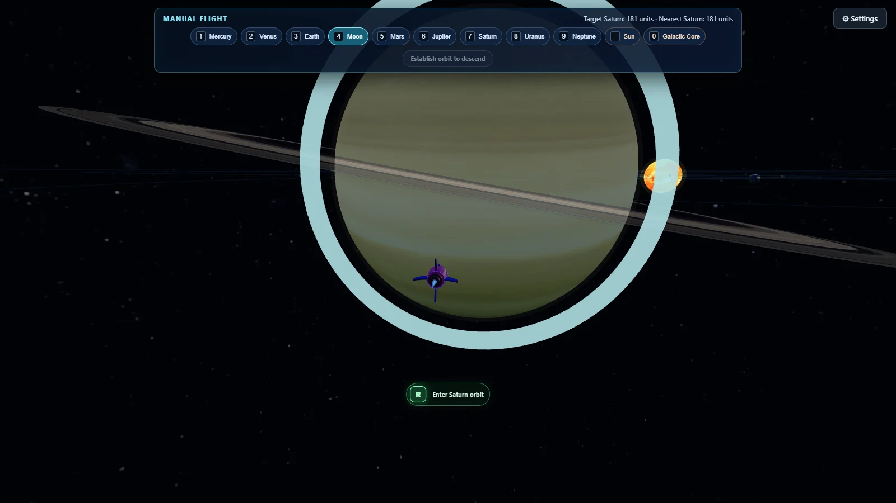
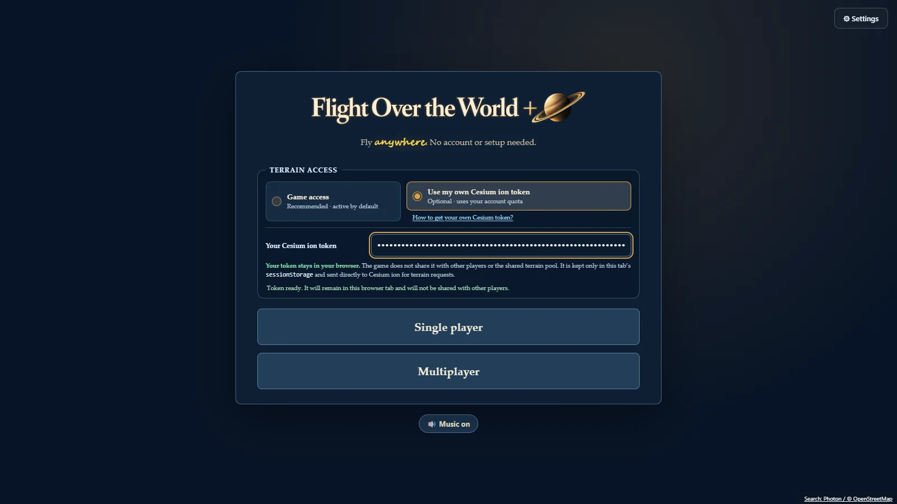
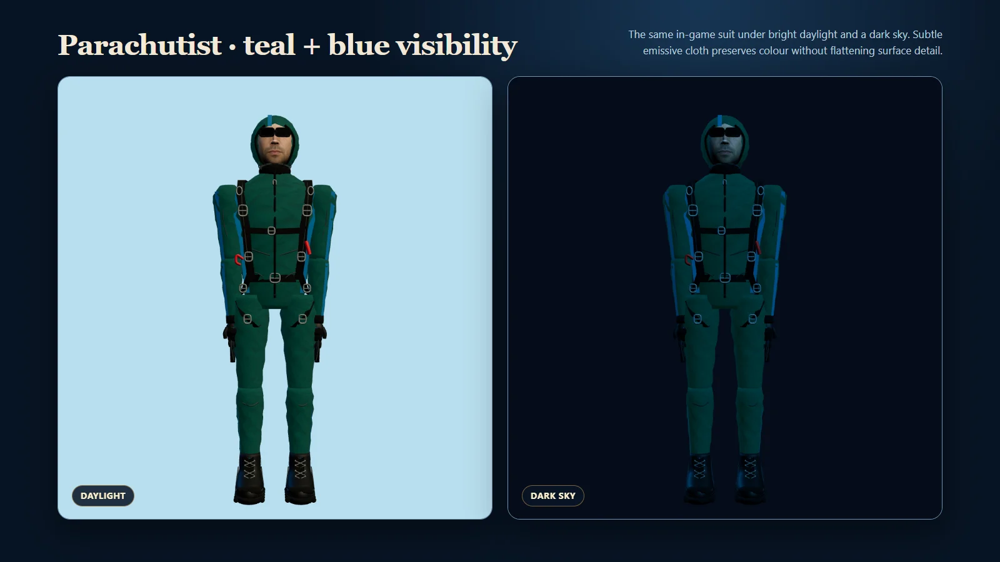
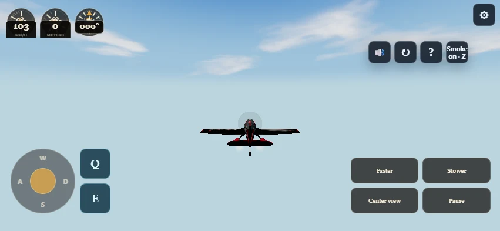
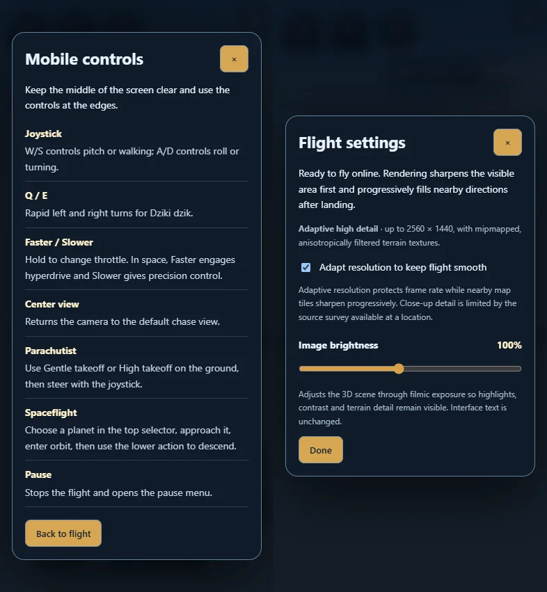

> Publiczny eksport z pominiętymi modułami. Zobacz [OMITTED-MODULES.md](OMITTED-MODULES.md). Pełne źródła i kompilacja są utrzymywane osobno.

<p align="center">
  
</p>

# Flight Over the World +

Przeglądarkowa gra o lataniu nad fotorealistyczną Ziemią i podróżach poza jej atmosferę. Wybierz samolot, spadochroniarza albo rakietę, wskaż dowolne miejsce startu i graj samodzielnie lub ze znajomymi.

## [▶ Graj online](https://headlost.github.io/flight-over-the-world-plus/)

[](https://headlost.github.io/flight-over-the-world-plus/)

Gra działa bez instalacji i bez zakładania konta. Domyślny dostęp do mapy jest aktywny od razu; własny token Cesium ion jest opcjonalny.

## Najważniejsze możliwości

- swobodny lot nad Google Photorealistic 3D Tiles, z adaptacyjną jakością i dokładnym doczytywaniem terenu;
- wybór miejsca startu przez nazwę, adres, współrzędne lub pinezkę na mapie OpenStreetMap;
- **Single Player** oraz pokoje **Multiplayer** z linkiem i kodem QR, wspólnym startem, czatem i rozmową głosową;
- siedem pojazdów i odmiennych stylów rozgrywki: samoloty turystyczne, pasażerskie i odrzutowe, akrobacyjny **Dziki dzik**, spadochroniarz oraz rakieta;
- akrobacje, dym, lądowanie, spacer po ulicach i dachach, widok pierwszoosobowy oraz ponowny start;
- pełny Układ Słoneczny, wejścia atmosferyczne, powierzchnie planet, Droga Mleczna, czarna dziura i sekwencja tesseraktu;
- zielono-turkusowy spadochroniarz z niebieskimi akcentami, czytelny na jasnym niebie i ciemnym tle;
- regulacja jasności oparta na ekspozycji oraz automatyczne skalowanie renderowania, bez nakładania wyblakłej warstwy na obraz;
- muzyka, proceduralne efekty silników i wiatru oraz osobna regulacja dźwięków otoczenia;
- dopracowany układ dotykowy w orientacji poziomej, z płynniejszym joystickiem i czystym środkiem ekranu.

## Galeria

Kliknij obraz, aby otworzyć go w pełnym rozmiarze.

<table>
  <tr>
    <td><a href="docs/screens/start-cesium-token.webp"></a></td>
    <td><a href="docs/screens/parachutist-preview.webp"></a></td>
  </tr>
  <tr>
    <td><a href="docs/screens/multiplayer-lobby.webp"></a></td>
    <td><a href="docs/screens/spaceflight.webp"></a></td>
  </tr>
  <tr>
    <td><a href="docs/screens/mobile-controls-landscape.webp"></a></td>
    <td><a href="docs/screens/mobile-help-settings.webp"></a></td>
  </tr>
</table>

## Opcjonalny własny token Cesium

Na ekranie startowym, obok wyboru **Single Player / Multiplayer**, można pozostawić zalecany dostęp domyślny albo wybrać **Use my Cesium token** i wkleić własny token Cesium ion. Własny token korzysta z limitu przypisanego do konta użytkownika; nie jest wymagany do zwykłego uruchomienia gry.

Bezpieczna konfiguracja w skrócie:

1. dodaj na koncie ion zasób **Google Photorealistic 3D Tiles (`2275207`)**;
2. utwórz osobny token dla gry;
3. nadaj mu tylko publiczne uprawnienie **`assets:read`** i, jeśli to możliwe, ogranicz go do assetu `2275207` oraz adresu strony;
4. wklej token w pole na ekranie startowym — nigdy do kodu, pliku `.env`, commita, zgłoszenia ani zrzutu ekranu.

Pełna instrukcja ze schematami:

- [Jak uzyskać własny token Cesium — dokumentacja](docs/CESIUM-TOKEN.md)
- [Jak uzyskać własny token Cesium — wersja dostępna w grze](public/cesium-token-guide.html)

Token aplikacji internetowej jest widoczny dla przeglądarki i nie powinien mieć prywatnych uprawnień. Gra **nie udostępnia własnego tokenu innym graczom ani nie przekazuje go do wspólnej puli operatora**. Zapisuje go wyłącznie w `sessionStorage` bieżącej karty i wysyła bezpośrednio do Cesium ion w żądaniach potrzebnych do wyświetlenia terenu. Po zakończeniu sesji karty przeglądarka usuwa ten zapis. W razie ujawnienia token należy unieważnić w panelu Cesium ion.

## Sterowanie

### Komputer

| Klawisz / gest | Działanie |
| --- | --- |
| `W` / `S` | Pochylenie; spadochroniarzem wznoszenie / szybsze opadanie |
| `A` / `D` | Przechylenie i zakręt; Dziki dzik wykonuje beczki |
| `Q` / `E` | Szybki zwrot Dzikiego dzika; w kosmosie `E` rozpoczyna dostępne podejście |
| `Shift` / `Ctrl` | Szybciej / wolniej; hiperprędkość / lot precyzyjny |
| `Z` | Włączenie lub wyłączenie podwójnego dymu Dzikiego dzika |
| `C` | Wyśrodkowanie kamery |
| `Esc` | Pauza |
| `Spacja` / `R` | Łagodny / wysoki start spadochroniarza; `R` steruje też startem i asystą rakiety |
| `1–9`, `0`, `−` | Wybór celu w trybie kosmicznym |
| prawy przycisk myszy + przeciąganie | Obrót kamery |
| kółko myszy | Zoom; maksymalne zbliżenie spadochroniarza włącza widok pierwszoosobowy |
| `T` — przytrzymaj | Rozmowa głosowa w multiplayer |

### Telefon

Najwygodniej gra się w orientacji poziomej:

- po lewej znajduje się wygładzony joystick oraz osobne przyciski **Q** i **E**;
- po prawej są akcje **Faster**, **Slower**, **Center view** i **Pause**;
- szeroki dolny przycisk pokazuje działanie właściwe dla sytuacji, np. **Approach a planet**;
- przycisk **Help / ?** otwiera pełną instrukcję, dzięki czemu opis sterowania nie zasłania rozgrywki;
- ustawienia obrazu i dźwięku rozwijają się w kompaktowym panelu, poza listą planet i głównymi kontrolkami.

Przyciski kontekstowe zmieniają się wraz z pojazdem i etapem lotu. W multiplayer link do pokoju można wysłać znajomym albo udostępnić jako kod QR.

## Uruchomienie lokalne

Pełne środowisko deweloperskie wymaga Node.js `22.13` lub nowszego.

```bash
npm install
npm start
```

Na Windows można również uruchomić `start-game.cmd`. Gry nie należy otwierać bezpośrednio przez `index.html`, ponieważ moduły korzystają z serwera Vite.

Ustawienia deweloperskie mogą znajdować się w ignorowanym pliku `.env.local`. Nie wolno umieszczać prawdziwych danych dostępowych w repozytorium ani w logach. Wariant z domyślnym dostępem przekazuje przez prywatny workflow tylko przydział i odnowienie sesji; kafelki terenu są pobierane bezpośrednio przez przeglądarkę.

## Jakość, prywatność i ograniczenia

- szczegółowość fotogrametrii zależy od pokrycia danych Google, połączenia, dostępnego limitu Cesium i wydajności GPU;
- fizyka, skala Układu Słonecznego i czarna dziura są świadomie stylizowanymi mechanikami gry, a nie symulacją naukową;
- domyślny dostęp do terenu zależy od dostępności kontrolowanej puli operatora; własny token korzysta z osobnego limitu konta użytkownika;
- wyszukiwanie miejsca korzysta z Photon, mapa wyboru z OpenStreetMap, teren z Cesium / Google, a funkcje sieciowe multiplayer z usług przeglądarkowych projektu;
- ustawienia gry są zapisywane lokalnie w przeglądarce, natomiast opcjonalny token Cesium tylko na czas bieżącej sesji;
- kod wykonywany po stronie klienta pozostaje możliwy do odczytania także po kompilacji i minifikacji — GitHub Secrets nie czynią klucza używanego w przeglądarce tajnym.

## Rozwój, testy i publiczna dystrybucja

Najważniejsze polecenia w pełnym lokalnym drzewie:

```bash
npm test
npm run build
npm run test:e2e
```

`npm run build` uruchamia testy jednostkowe przed kompilacją. Zmiany renderowania należy dodatkowo sprawdzać w przeglądarce, ze szczególnym uwzględnieniem ostrości terenu, ciągłości kafelków oraz układu mobilnego.

To repozytorium jest publikowane jako niezależny projekt, a nie fork. Pełne drzewo deweloperskie pozostaje lokalne. Publiczna gałąź `codex/public-source` zawiera wygenerowany snapshot z modułami wskazanymi w [`scripts/public-source-manifest.json`](scripts/public-source-manifest.json) celowo pominiętymi i nie jest samodzielnym kompletem do przebudowania gry. Gałąź `codex/site` zawiera wyłącznie zweryfikowany wynik `dist` używany przez GitHub Pages.

Publiczny snapshot powstaje poleceniem:

```bash
node scripts/export-public-source.mjs
```

Szczegółowe granice publikacji opisuje [docs/PUBLIC-SOURCE.md](docs/PUBLIC-SOURCE.md). Informacje o utrzymaniu i regresjach znajdują się w [docs/MAINTENANCE.md](docs/MAINTENANCE.md) oraz [docs/REVIEW.md](docs/REVIEW.md).

## Pochodzenie projektu

Pierwsza wersja **Flight Over the World +** powstała na bazie otwartego projektu [`bartosz-ciesielski/flight-over-the-world`](https://github.com/bartosz-ciesielski/flight-over-the-world), stworzonego przez Bartosza Ciesielskiego. Dziękujemy autorowi pierwotnej wersji za udostępnienie pracy na licencji MIT.

To niezależnie rozwijane repozytorium — nie jest oficjalnym wydaniem pierwotnego projektu ani nie sugeruje partnerstwa czy afiliacji z jego autorem. Oryginalna nota prawna została zachowana w [LICENSE](LICENSE), a informacje o wykorzystanych materiałach i pozostałych autorach znajdują się w [THIRD_PARTY_NOTICES.md](THIRD_PARTY_NOTICES.md).

Dołączone nagrania, tekstury i inne materiały mogą podlegać odrębnym warunkom; licencja kodu nie nadaje automatycznie prawa do ich ponownego wykorzystania.
