> Publiczny eksport z pominiętymi modułami. Zobacz [OMITTED-MODULES.md](OMITTED-MODULES.md). Pełne źródła i kompilacja są utrzymywane osobno.

<p align="center">
  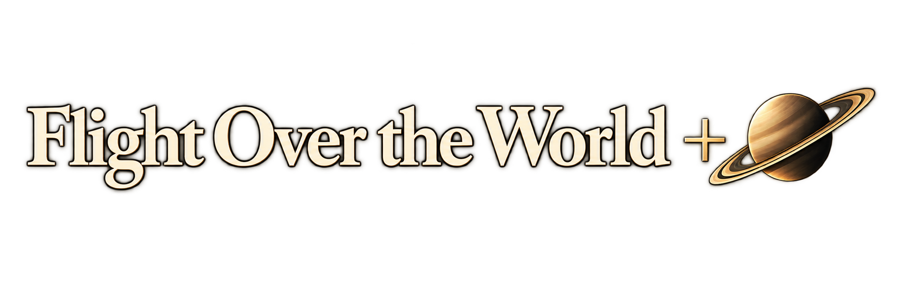
</p>

# Flight Over the World +

Przeglądarkowa gra o lataniu nad fotorealistyczną Ziemią i podróżach poza jej atmosferę. Wybierz samolot, spadochroniarza albo rakietę, wskaż dowolne miejsce startu i graj samodzielnie lub ze znajomymi.

## [▶ Graj online](https://headlost.github.io/flight-over-the-world-plus/)

[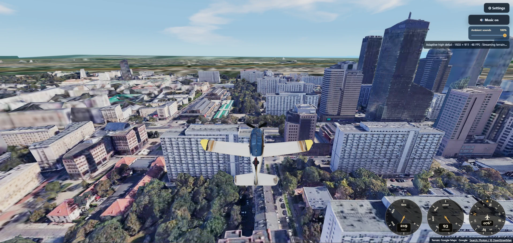](https://headlost.github.io/flight-over-the-world-plus/)

Gra działa bez instalacji i bez zakładania konta. Domyślny dostęp do mapy jest aktywny od razu; własny token Cesium ion jest opcjonalny.

## Najważniejsze możliwości

- swobodny lot nad Google Photorealistic 3D Tiles, z adaptacyjną jakością i dodatkowym priorytetem doczytywania wąskiego pasa przed samolotem podczas przyspieszania;
- wybór miejsca startu przez nazwę, adres, współrzędne lub pinezkę na mapie OpenStreetMap;
- **Single Player** oraz pokoje **Multiplayer** z linkiem i kodem QR, wspólnym startem, czatem i rozmową głosową;
- dziewięć aktywnych wyborów: **Mooney M20M**, **Boeing 737-800**, **Airbus A380**, **AC-130 Hercules**, **B-2 Spirit**, **Fighter**, akrobacyjny **Dziki dzik**, rakieta i spadochroniarz — z autorskimi modelami Headlost;
- obracające się śmigła, efekty dysz silników odrzutowych oraz domyślnie włączone, przełączane smugi kondensacyjne Boeinga i Airbusa;
- akrobacje, dym, lądowanie, spacer po ulicach i dachach, widok pierwszoosobowy oraz ponowny start;
- pełny Układ Słoneczny, wejścia atmosferyczne, powierzchnie planet, Droga Mleczna, czarna dziura i sekwencja tesseraktu;
- zaktualizowaną postać spadochroniarza z animacją linek, lądowania, chodu i biegu oraz trzema ustawieniami kamery na padzie;
- sterowanie klawiaturą i myszą, dotykiem albo padem także w lobby, na mapie startowej, w ustawieniach i w pauzie; wibracje reagujące m.in. na gaz, lądowanie, zderzenie i zbliżanie się do czarnej dziury;
- możliwość ukrycia HUD bez wyłączania komunikatów bezpieczeństwa, rozmowy głosowej i informacji o mapach;
- regulacja jasności 0–100% z neutralnym ustawieniem 50%, oparta na ekspozycji i bez nakładania wyblakłej warstwy na obraz;
- muzyka, proceduralne efekty silników i wiatru oraz osobna regulacja dźwięków otoczenia;
- dopracowany układ dotykowy w orientacji poziomej, z płynniejszym joystickiem i czystym środkiem ekranu.

## Galeria

Kliknij obraz, aby otworzyć go w pełnym rozmiarze.

<table>
  <tr>
    <td><a href="docs/screens/start-keyboard.webp">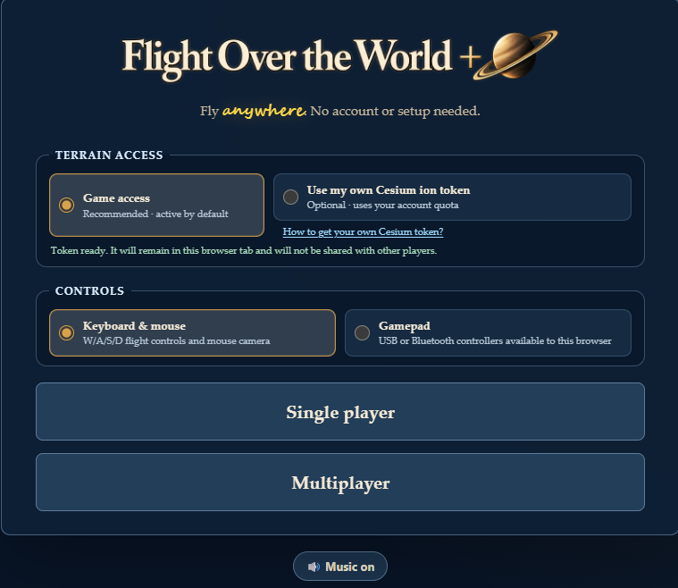</a></td>
    <td><a href="docs/screens/start-own-token.webp">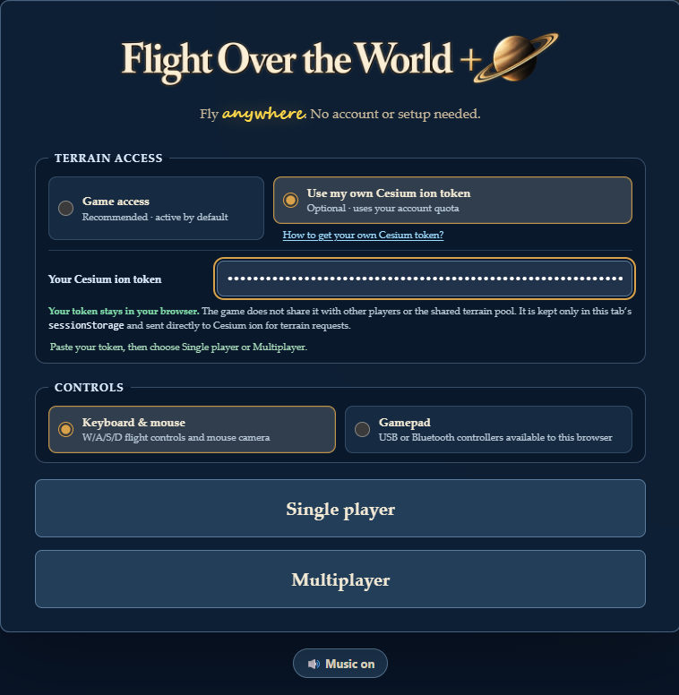</a></td>
  </tr>
  <tr>
    <td><a href="docs/screens/start-gamepad.webp">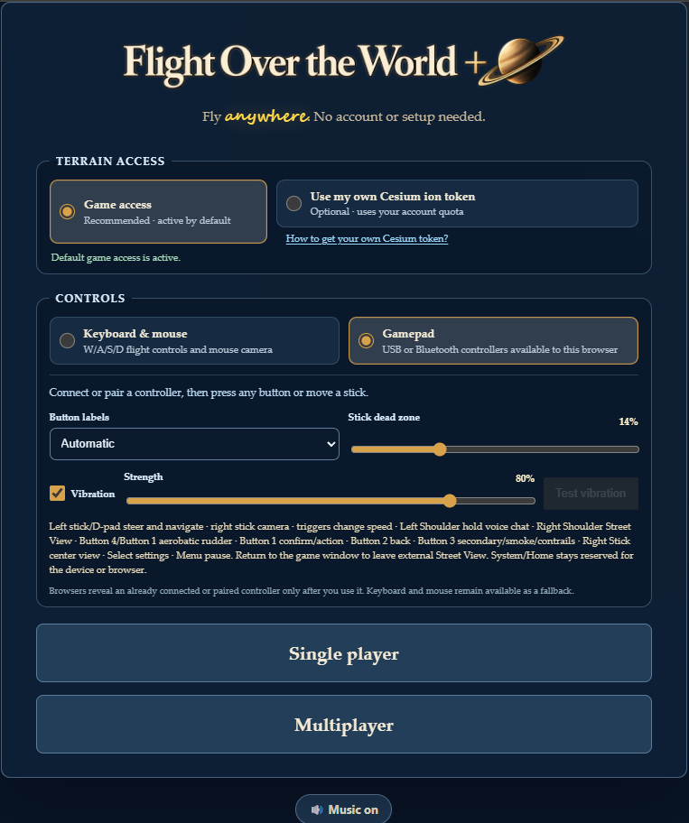</a></td>
    <td><a href="docs/screens/fighter-selection.webp">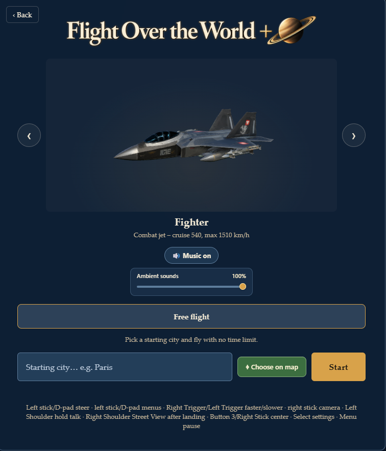</a></td>
  </tr>
  <tr>
    <td><a href="docs/screens/multiplayer-lobby.webp">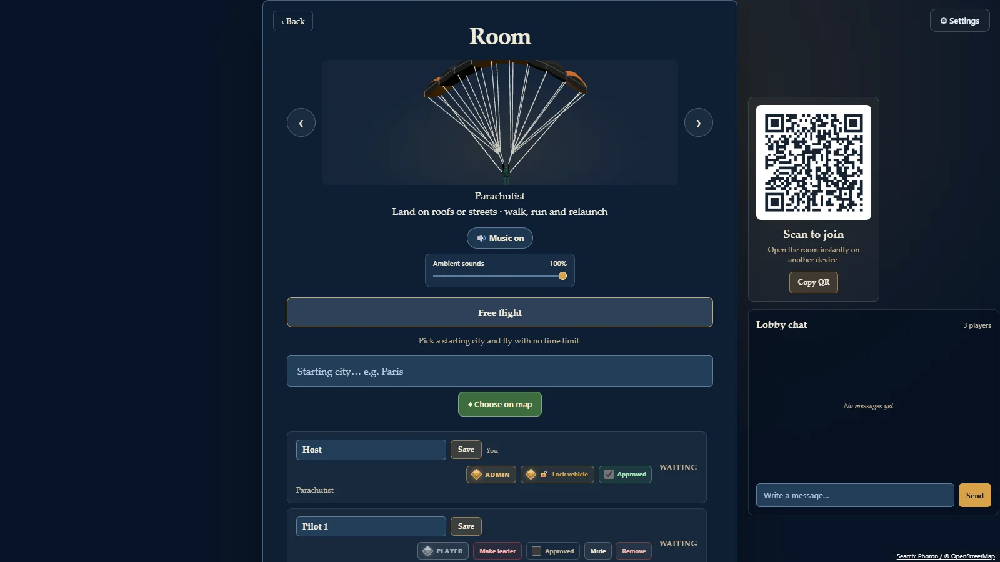</a></td>
    <td><a href="docs/screens/multiplayer-room-current.webp">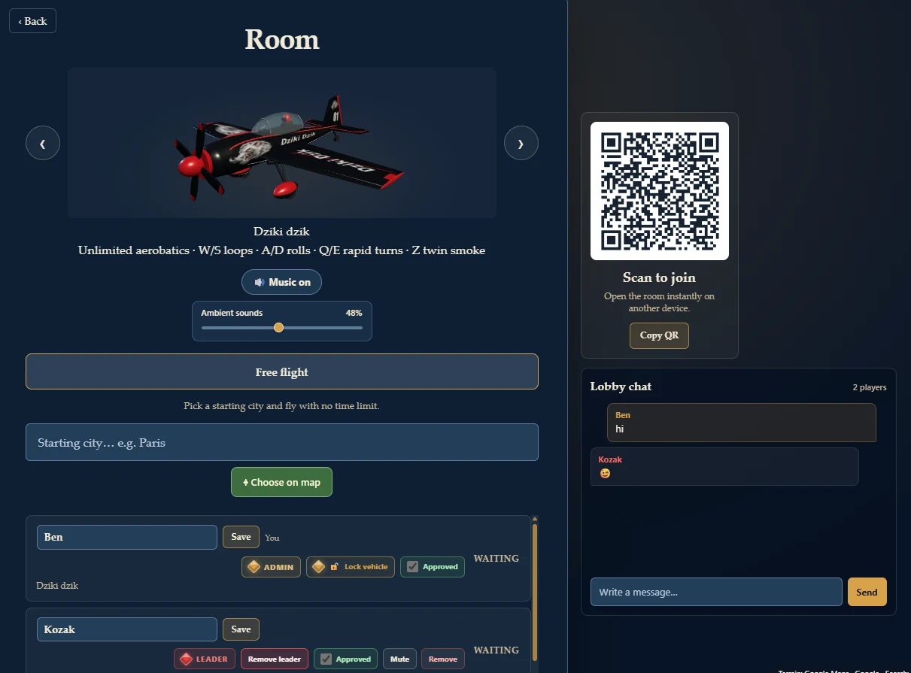</a></td>
  </tr>
  <tr>
    <td><a href="docs/screens/earth-space.webp">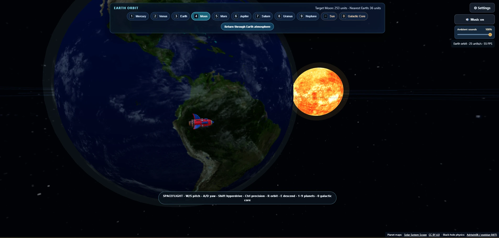</a></td>
    <td><a href="docs/screens/black-hole-new.webp">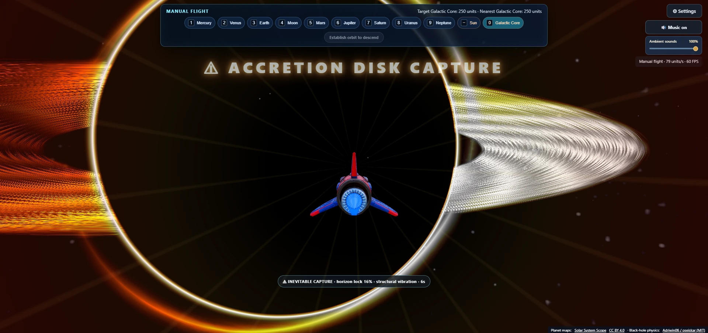</a></td>
  </tr>
  <tr>
    <td><a href="docs/screens/saturn-flight.webp">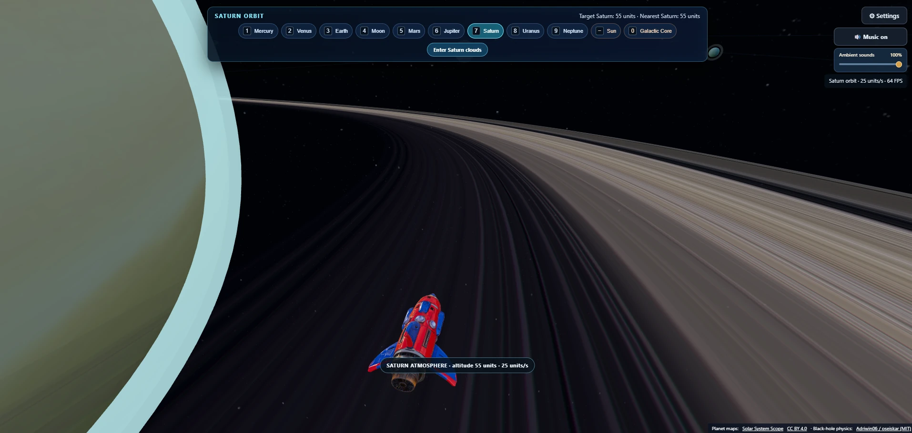</a></td>
    <td><a href="docs/screens/parachutist-warsaw.webp">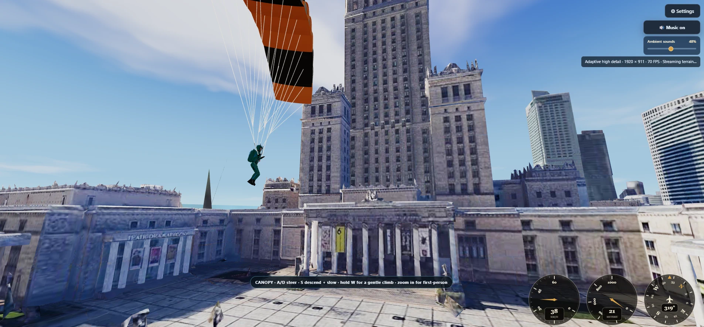</a></td>
  </tr>
  <tr>
    <td><a href="docs/screens/parachutist-city.webp">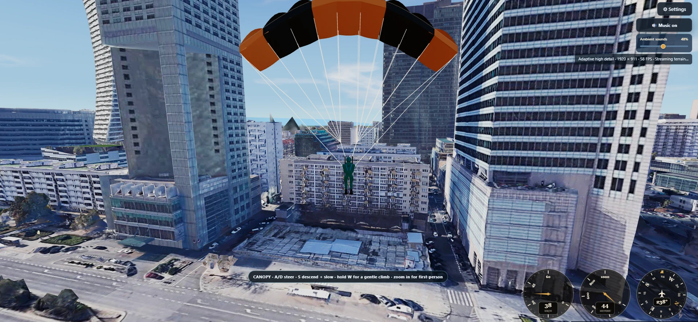</a></td>
    <td><a href="docs/screens/parachutist-alcatraz.webp">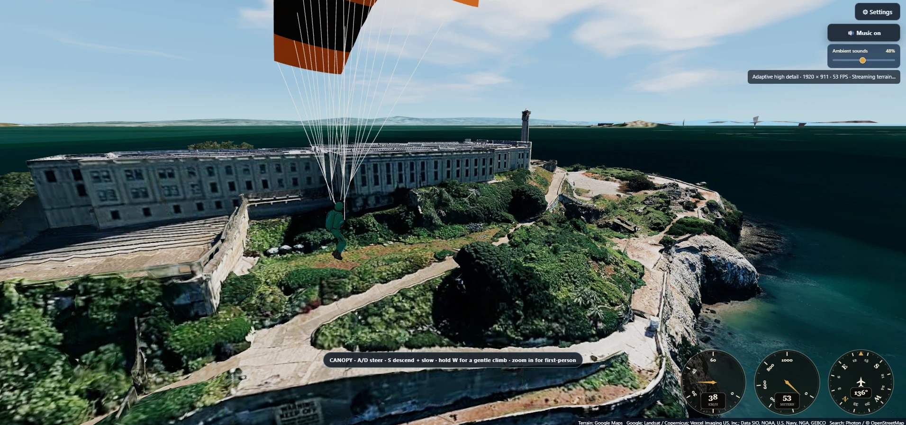</a></td>
  </tr>
  <tr>
    <td colspan="2" align="center"><a href="docs/screens/b2-flight.webp">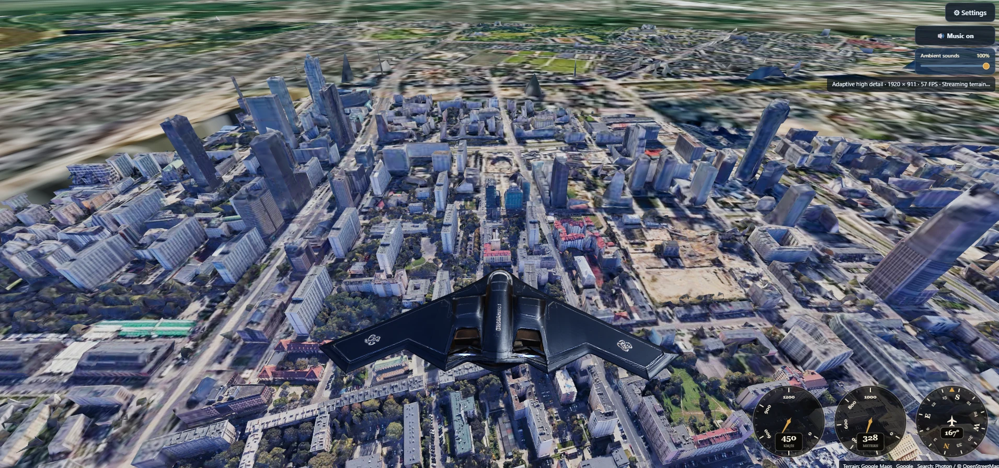</a></td>
  </tr>
</table>

## Opcjonalny własny token Cesium

Na ekranie startowym, obok wyboru **Single Player / Multiplayer**, można pozostawić zalecany dostęp domyślny albo wybrać **Use my own Cesium ion token** i wkleić własny token Cesium ion. Własny token korzysta z limitu przypisanego do konta użytkownika; nie jest wymagany do zwykłego uruchomienia gry.

Bezpieczna konfiguracja w skrócie:

1. dodaj na koncie ion zasób **Google Photorealistic 3D Tiles (`2275207`)**;
2. utwórz osobny token dla gry;
3. nadaj mu tylko publiczne uprawnienie **`assets:read`** i, jeśli to możliwe, ogranicz go do assetu `2275207` oraz adresu strony;
4. wklej token w pole na ekranie startowym — nigdy do kodu, pliku `.env`, commita, zgłoszenia ani zrzutu ekranu.

Pełna instrukcja z aktualnymi, zanonimizowanymi zrzutami ekranu i żółtymi
strzałkami przy uzupełnianych polach:

- [Jak uzyskać własny token Cesium — dokumentacja](docs/CESIUM-TOKEN.md)
- [Jak uzyskać własny token Cesium — wersja dostępna w grze](https://headlost.github.io/flight-over-the-world-plus/cesium-token-guide.html)

Token aplikacji internetowej jest widoczny dla przeglądarki i nie powinien mieć prywatnych uprawnień. Gra **nie udostępnia własnego tokenu innym graczom ani nie przekazuje go do wspólnej puli operatora**. Zapisuje go wyłącznie w `sessionStorage` bieżącej karty i wysyła bezpośrednio do Cesium ion w żądaniach potrzebnych do wyświetlenia terenu. Po zakończeniu sesji karty przeglądarka usuwa ten zapis. W razie ujawnienia token należy unieważnić w panelu Cesium ion.

## Sterowanie

### Komputer

| Klawisz / gest | Działanie |
| --- | --- |
| `W` / `S` | Pochylenie; spadochroniarzem wznoszenie / szybsze opadanie |
| `A` / `D` | Przechylenie i zakręt; Dziki dzik wykonuje beczki |
| `Q` / `E` | Szybki zwrot Dzikiego dzika; w kosmosie `E` rozpoczyna dostępne podejście |
| `Shift` / `Ctrl` | Szybciej / wolniej; hiperprędkość / lot precyzyjny |
| `Z` | Włączenie lub wyłączenie dymu Dzikiego dzika albo smug Boeinga i Airbusa |
| `C` | Wyśrodkowanie kamery |
| `Esc` | Pauza |
| `Spacja` / `R` | Łagodny / wysoki start spadochroniarza; `R` steruje też startem i asystą rakiety |
| `1–9`, `0`, `−` | Wybór celu w trybie kosmicznym |
| prawy przycisk myszy + przeciąganie | Obrót kamery |
| kółko myszy | Zoom; maksymalne zbliżenie spadochroniarza włącza widok pierwszoosobowy |
| `T` — przytrzymaj | Rozmowa głosowa w multiplayer |

### Pad na komputerze

Po otwarciu strony wybrana jest klawiatura. Można przełączyć się na pad USB lub Bluetooth udostępniony przez przeglądarkę; podpowiedzi nazw przycisków dopasowują się do wykrytego układu. Poniżej użyto oznaczeń pada Xbox:

| Przycisk | Działanie |
| --- | --- |
| Lewa gałka / krzyżak | Sterowanie w grze; w menu krzyżak porusza fokusem, a lewa gałka w poziomie przełącza pojazdy |
| Prawa gałka | Rozglądanie się |
| `RT` / `LT` | Przyspieszanie / zwalnianie |
| `A` | Potwierdzenie, akcja kontekstowa; w kosmosie wejście na orbitę |
| `B` | Powrót lub anulowanie |
| `X` | Dym lub smugi; u spadochroniarza kolejno bliższa kamera, widok pierwszoosobowy i dalsza kamera |
| `Y` | Wysoki start spadochroniarza lub wejście rakietą w atmosferę; z `A` steruje bezpośrednim skrętem Dzikiego dzika |
| `LB` — przytrzymaj | Rozmowa głosowa w multiplayer |
| `RB` | Street View po lądowaniu; po przełączeniu z okna Map Google z powrotem do gry następuje powrót do rozgrywki |
| `View` / `Menu` | Ustawienia / pauza; `Menu` uruchamia grę z lobby |

Na mapie `X` podnosi lub odkłada pinezkę; przesuwa się ją krzyżakiem albo gałką. Pola miasta i nazwy gracza otwierają klawiaturę ekranową obsługiwaną padem. W pauzie można sterować muzyką i głośnością ambientu. Wibracje mają różną siłę w menu, przy przyspieszaniu, kolizjach, lądowaniu i blisko czarnej dziury; można je regulować lub wyłączyć. Działają tylko wtedy, gdy przeglądarka i pad udostępniają tę funkcję.

### Telefon

Najwygodniej gra się w orientacji poziomej:

- po lewej znajduje się wygładzony joystick oraz osobne przyciski **Q** i **E**;
- po prawej są akcje **Faster**, **Slower**, **Center view** i **Pause**;
- szeroki dolny przycisk pokazuje działanie właściwe dla sytuacji, np. **Approach a planet**;
- przycisk **Help / ?** otwiera pełną instrukcję, dzięki czemu opis sterowania nie zasłania rozgrywki;
- ustawienia obrazu i dźwięku rozwijają się w kompaktowym panelu, poza listą planet i głównymi kontrolkami.

Przyciski kontekstowe zmieniają się wraz z pojazdem i etapem lotu. W multiplayer link do pokoju można wysłać znajomym albo udostępnić jako kod QR.

## Uruchomienie lokalne

Pełne środowisko deweloperskie wymaga Node.js `22.13` lub nowszego.

```bash
npm install
npm start
```

Na Windows można również uruchomić `start-game.cmd`. Gry nie należy otwierać bezpośrednio przez `index.html`, ponieważ moduły korzystają z serwera Vite.

Ustawienia deweloperskie mogą znajdować się w ignorowanym pliku `.env.local`. Nie wolno umieszczać prawdziwych danych dostępowych w repozytorium ani w logach. Wariant z domyślnym dostępem przekazuje przez prywatny workflow tylko przydział i odnowienie sesji; kafelki terenu są pobierane bezpośrednio przez przeglądarkę.

## Jakość, prywatność i ograniczenia

- szczegółowość fotogrametrii zależy od pokrycia danych Google, połączenia, dostępnego limitu Cesium i wydajności GPU;
- fizyka, skala Układu Słonecznego i czarna dziura są świadomie stylizowanymi mechanikami gry, a nie symulacją naukową;
- domyślny dostęp do terenu zależy od dostępności kontrolowanej puli operatora; własny token korzysta z osobnego limitu konta użytkownika;
- wyszukiwanie miejsca korzysta z Photon, mapa wyboru z OpenStreetMap, teren z Cesium / Google, a funkcje sieciowe multiplayer z usług przeglądarkowych projektu;
- ustawienia gry są zapisywane lokalnie w przeglądarce, natomiast opcjonalny token Cesium tylko na czas bieżącej sesji;
- kod wykonywany po stronie klienta pozostaje możliwy do odczytania także po kompilacji i minifikacji — GitHub Secrets nie czynią klucza używanego w przeglądarce tajnym.

## Rozwój, testy i publiczna dystrybucja

Najważniejsze polecenia w pełnym lokalnym drzewie:

```bash
npm test
npm run build
npm run test:e2e
```

`npm run build` uruchamia testy jednostkowe przed kompilacją. Zmiany renderowania należy dodatkowo sprawdzać w przeglądarce, ze szczególnym uwzględnieniem ostrości terenu, ciągłości kafelków oraz układu mobilnego.

To repozytorium jest publikowane jako niezależny projekt, a nie fork. Pełne drzewo deweloperskie pozostaje lokalne. Publiczna gałąź `codex/public-source` zawiera wygenerowany snapshot z modułami wskazanymi w [`scripts/public-source-manifest.json`](scripts/public-source-manifest.json) celowo pominiętymi i nie jest samodzielnym kompletem do przebudowania gry. Gałąź `codex/site` zawiera wyłącznie zweryfikowany wynik `dist` używany przez GitHub Pages.

Publiczny snapshot powstaje poleceniem:

```bash
node scripts/export-public-source.mjs
```

Szczegółowe granice publikacji opisuje [docs/PUBLIC-SOURCE.md](docs/PUBLIC-SOURCE.md). Informacje o utrzymaniu i regresjach znajdują się w [docs/MAINTENANCE.md](docs/MAINTENANCE.md) oraz [docs/REVIEW.md](docs/REVIEW.md).

## Modele i pochodzenie

Obecna gra jest gruntownie przebudowanym, niezależnie rozwijanym projektem. Modele aktywnych pojazdów i postaci są autorskimi projektami **Headlost**, zgodnie z oświadczeniem właściciela projektu; wcześniejsze zewnętrzne modele pojazdów zostały zarchiwizowane i nie są już używane w grze. Eksperymentalny tryb swobodnego lotu postacią pozostaje na razie poza aktywną flotą.

Historyczne pochodzenie kodu i wymagane noty prawne zachowano w [LICENSE](LICENSE) i [THIRD_PARTY_NOTICES.md](THIRD_PARTY_NOTICES.md). Materiały dostawców map, biblioteki, muzyka i inne zasoby mogą mieć odrębne warunki; autorstwo modeli nie zmienia ich licencji.
