<a name="language"></a>

<p align="center">
  <strong>Wybierz język / Choose your language</strong><br>
  <a href="#polski">🇵🇱 Polski</a> &nbsp; | &nbsp; <a href="#english">🇬🇧 English ↓</a>
</p>

> Publiczny eksport z pominiętymi modułami / Public source snapshot with selected modules omitted. Zobacz / See [OMITTED-MODULES.md](OMITTED-MODULES.md). Pełne źródła i kompilacja są utrzymywane osobno / The complete sources and build are maintained separately.

<p align="center">
  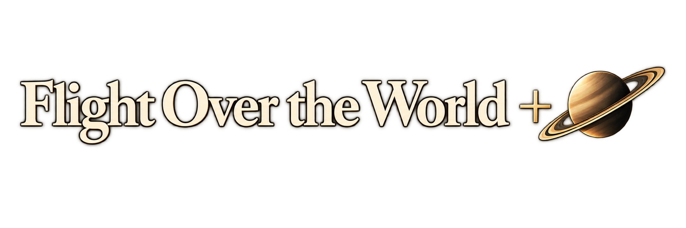
</p>

<a name="polski"></a>

# Flight Over the World +

**Polska wersja** · [Read in English ↓](#english)

Przeglądarkowa gra o lataniu nad fotorealistyczną Ziemią i podróżach poza jej atmosferę. Wybierz samolot, spadochroniarza albo rakietę, wskaż dowolne miejsce startu i graj samodzielnie lub ze znajomymi.

## [▶ Graj online](https://headlost.github.io/flight-over-the-world-plus/)

[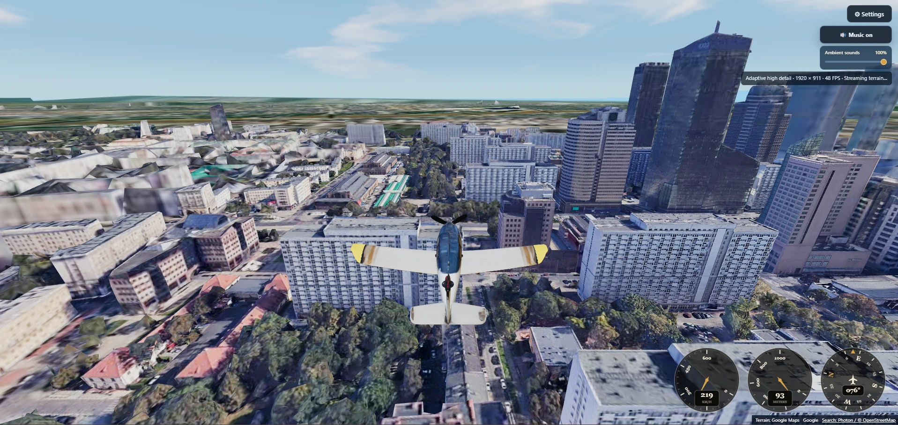](https://headlost.github.io/flight-over-the-world-plus/)

Gra działa bez instalacji i bez zakładania konta. Domyślny dostęp do mapy jest aktywny od razu; własny token Cesium ion jest opcjonalny.

## Najważniejsze możliwości

- swobodny lot nad Google Photorealistic 3D Tiles, z adaptacyjną jakością i dodatkowym priorytetem doczytywania wąskiego pasa przed samolotem podczas przyspieszania;
- wybór miejsca startu przez nazwę, adres, współrzędne lub pinezkę na mapie OpenStreetMap; **Choose your departure** rozpoznaje popularne polskie i angielskie nazwy miast, pokazuje wyniki z krajem i regionem oraz obsługuje współrzędne N/S/E/W i stopnie, minuty, sekundy (np. `29.0000° N, 79.0000° W`);
- **Single Player** oraz pokoje **Multiplayer** z linkiem i kodem QR, wspólnym startem, czatem i rozmową głosową;
- dziewięć aktywnych wyborów: **Mooney M20M**, **Boeing 737-800**, **Airbus A380**, **AC-130 Hercules**, **B-2 Spirit**, **Fighter**, akrobacyjny **Dziki dzik**, rakieta i spadochroniarz — z autorskimi modelami Headlost;
- obracające się śmigła, efekty dysz silników odrzutowych oraz domyślnie włączone, przełączane smugi kondensacyjne Boeinga i Airbusa;
- akrobacje, dym, lądowanie, spacer po ulicach i dachach, widok pierwszoosobowy oraz ponowny start;
- pełny Układ Słoneczny, wejścia atmosferyczne, powierzchnie planet, Droga Mleczna, czarna dziura i sekwencja tesseraktu;
- zaktualizowaną postać spadochroniarza z animacją linek, lądowania, chodu i biegu oraz trzema ustawieniami kamery na padzie;
- sterowanie klawiaturą i myszą, dotykiem albo padem także w lobby, na mapie startowej, w ustawieniach i w pauzie; wibracje reagujące m.in. na gaz, lądowanie, zderzenie i zbliżanie się do czarnej dziury;
- możliwość ukrycia HUD bez wyłączania komunikatów bezpieczeństwa, rozmowy głosowej i informacji o mapach;
- regulacja jasności 0–100% z neutralnym ustawieniem 50%, oparta na ekspozycji i bez nakładania wyblakłej warstwy na obraz;
- muzyka, proceduralne efekty silników i wiatru oraz osobna regulacja dźwięków otoczenia;
- dopracowany układ dotykowy w orientacji poziomej, z płynniejszym joystickiem i czystym środkiem ekranu.

## Galeria

Kliknij obraz, aby otworzyć go w pełnym rozmiarze.

<table>
  <tr>
    <td><a href="docs/screens/start-keyboard.webp">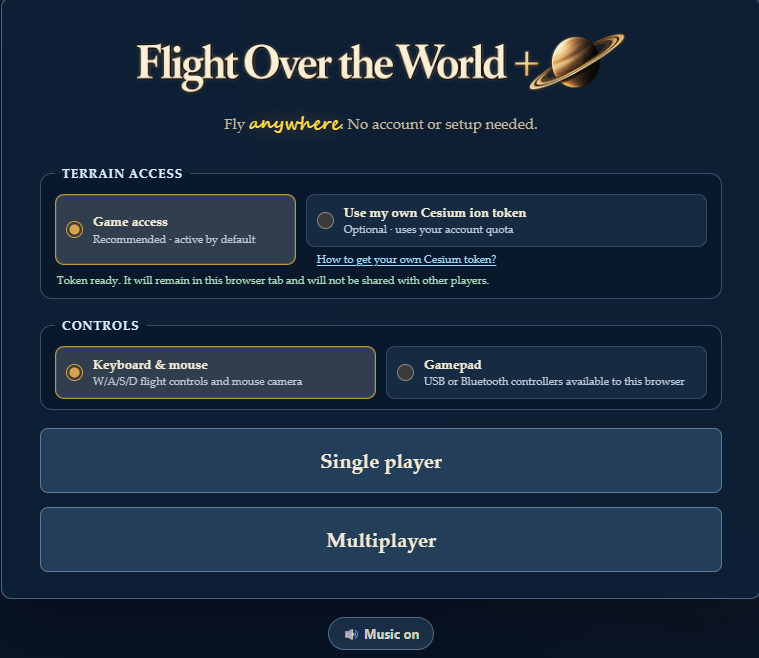</a></td>
    <td><a href="docs/screens/start-own-token.webp">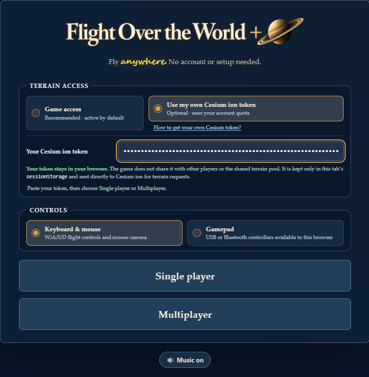</a></td>
  </tr>
  <tr>
    <td><a href="docs/screens/start-gamepad.webp">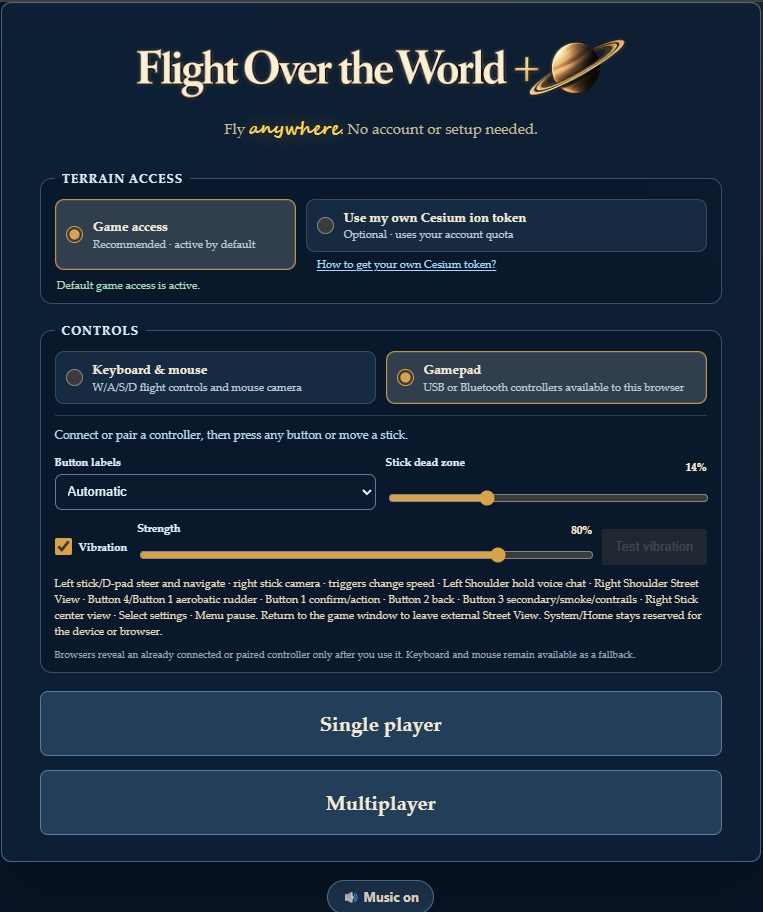</a></td>
    <td><a href="docs/screens/fighter-selection.webp">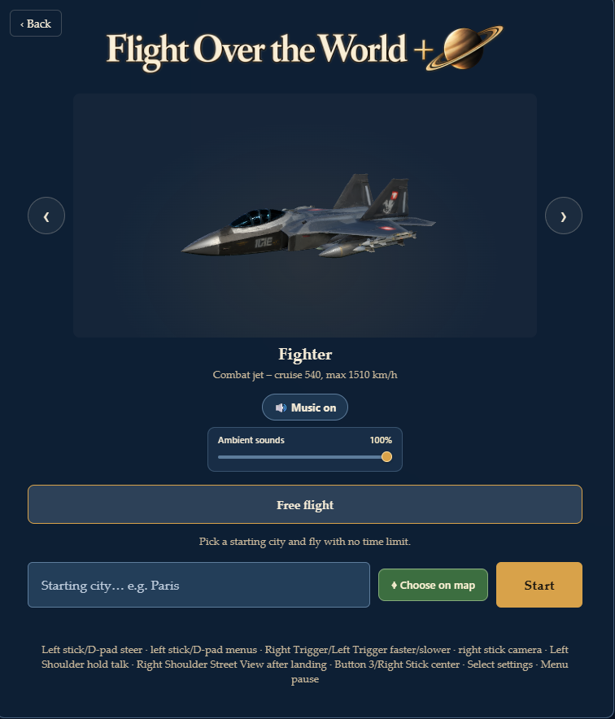</a></td>
  </tr>
  <tr>
    <td><a href="docs/screens/multiplayer-lobby.webp">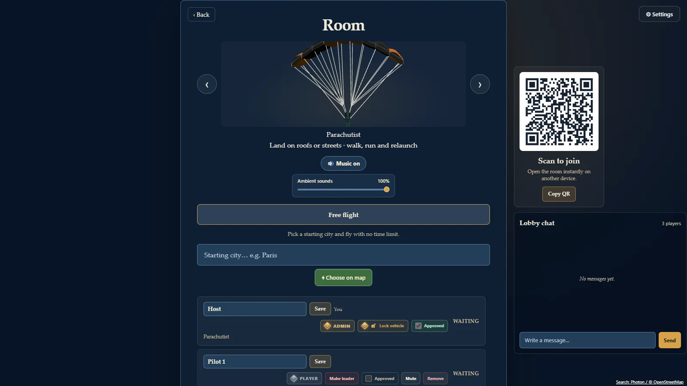</a></td>
    <td><a href="docs/screens/multiplayer-room-current.webp">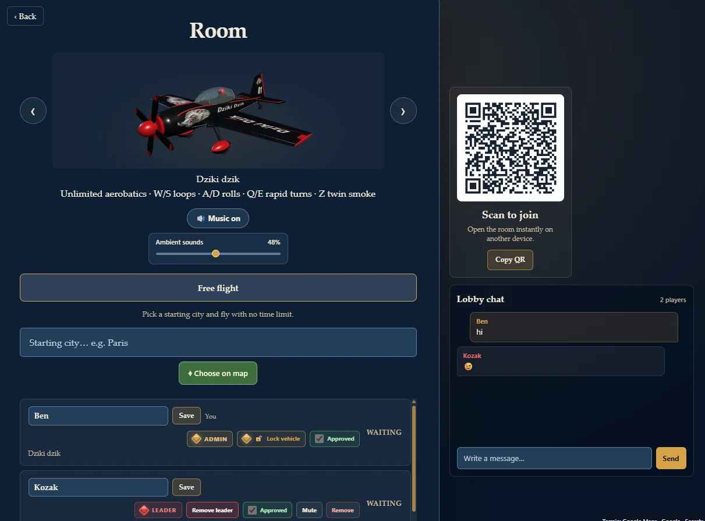</a></td>
  </tr>
  <tr>
    <td><a href="docs/screens/earth-space.webp">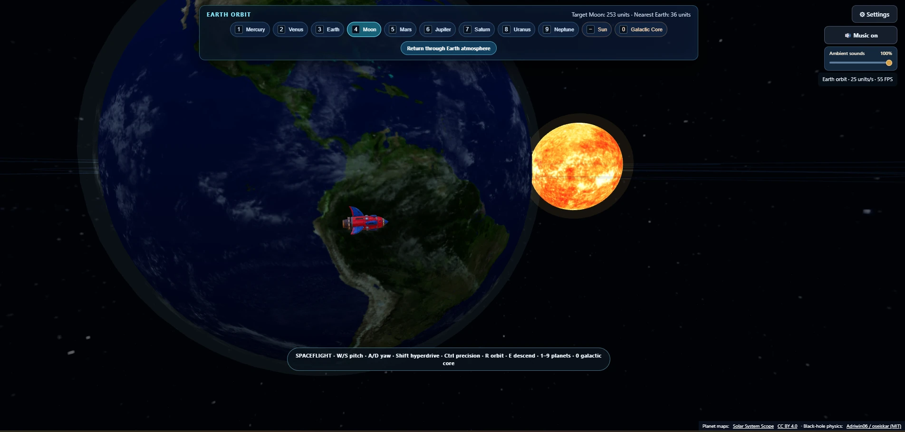</a></td>
    <td><a href="docs/screens/black-hole-new.webp">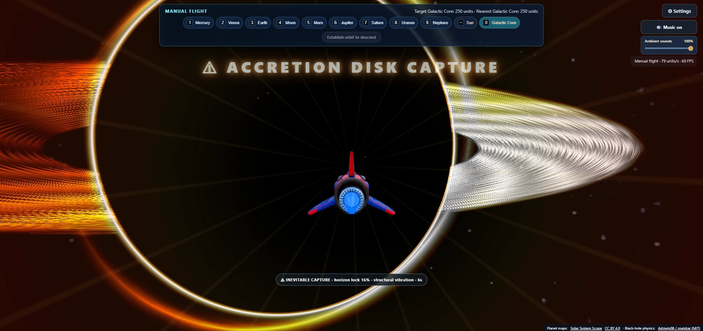</a></td>
  </tr>
  <tr>
    <td><a href="docs/screens/saturn-flight.webp">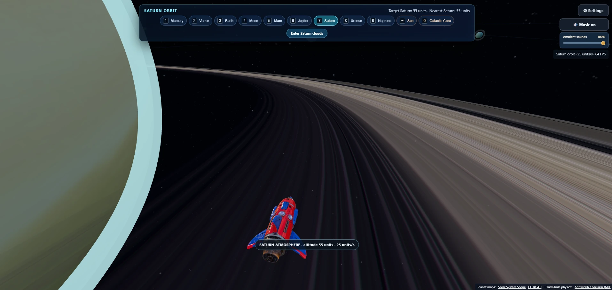</a></td>
    <td><a href="docs/screens/parachutist-warsaw.webp">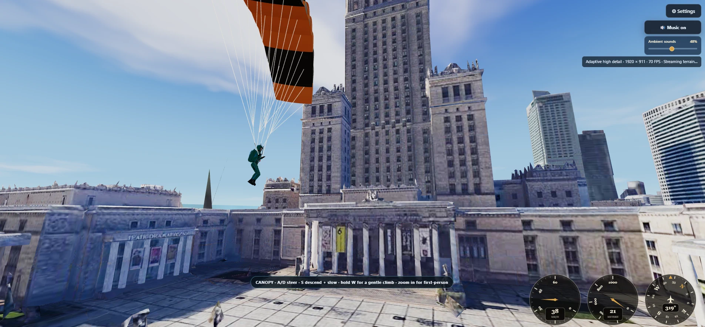</a></td>
  </tr>
  <tr>
    <td><a href="docs/screens/parachutist-city.webp">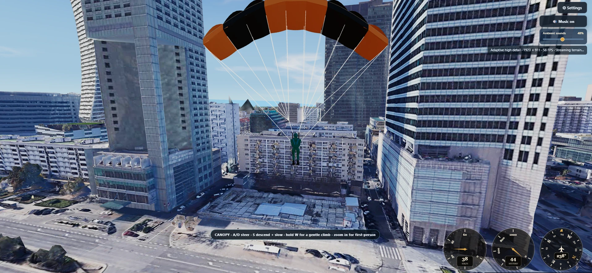</a></td>
    <td><a href="docs/screens/parachutist-alcatraz.webp">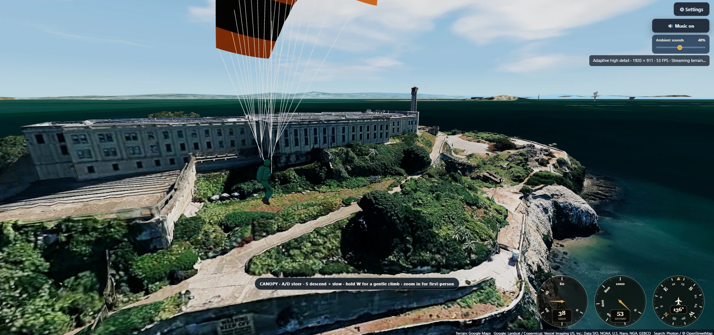</a></td>
  </tr>
  <tr>
    <td colspan="2" align="center"><a href="docs/screens/b2-flight.webp">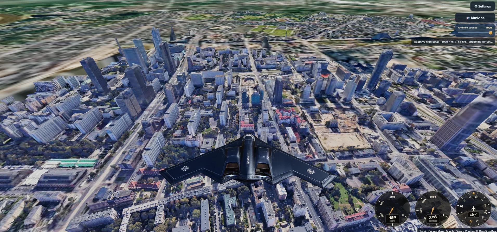</a></td>
  </tr>
</table>

## Opcjonalny własny token Cesium

Na ekranie startowym, obok wyboru **Single Player / Multiplayer**, można pozostawić zalecany dostęp domyślny albo wybrać **Use my own Cesium ion token** i wkleić własny token Cesium ion. Własny token korzysta z limitu przypisanego do konta użytkownika; nie jest wymagany do zwykłego uruchomienia gry.

Bezpieczna konfiguracja w skrócie:

1. dodaj na koncie ion zasób **Google Photorealistic 3D Tiles (`2275207`)**;
2. utwórz osobny token dla gry;
3. nadaj mu tylko publiczne uprawnienie **`assets:read`** i, jeśli to możliwe, ogranicz go do assetu `2275207` oraz adresu strony;
4. wklej token w pole na ekranie startowym — nigdy do kodu, pliku `.env`, commita, zgłoszenia ani zrzutu ekranu.

Pełna instrukcja z aktualnymi, zanonimizowanymi zrzutami ekranu i żółtymi
strzałkami przy uzupełnianych polach:

- [Jak uzyskać własny token Cesium — dokumentacja](docs/CESIUM-TOKEN.md)
- [Jak uzyskać własny token Cesium — wersja dostępna w grze](https://headlost.github.io/flight-over-the-world-plus/cesium-token-guide.html)

Token aplikacji internetowej jest widoczny dla przeglądarki i nie powinien mieć prywatnych uprawnień. Gra **nie udostępnia własnego tokenu innym graczom ani nie przekazuje go do wspólnej puli operatora**. Zapisuje go wyłącznie w `sessionStorage` bieżącej karty i wysyła bezpośrednio do Cesium ion w żądaniach potrzebnych do wyświetlenia terenu. Po zakończeniu sesji karty przeglądarka usuwa ten zapis. W razie ujawnienia token należy unieważnić w panelu Cesium ion.

## Sterowanie

### Komputer

| Klawisz / gest | Działanie |
| --- | --- |
| `W` / `S` | Pochylenie; spadochroniarzem wznoszenie / szybsze opadanie |
| `A` / `D` | Przechylenie i zakręt; Dziki dzik wykonuje beczki |
| `Q` / `E` | Szybki zwrot Dzikiego dzika; w kosmosie `E` rozpoczyna dostępne podejście |
| `Shift` / `Ctrl` | Szybciej / wolniej; hiperprędkość / lot precyzyjny |
| `Z` | Włączenie lub wyłączenie dymu Dzikiego dzika albo smug Boeinga i Airbusa |
| `C` | Wyśrodkowanie kamery |
| `Esc` | Pauza |
| `Spacja` / `R` | Łagodny / wysoki start spadochroniarza; `R` steruje też startem i asystą rakiety |
| `1–9`, `0`, `−` | Wybór celu w trybie kosmicznym |
| prawy przycisk myszy + przeciąganie | Obrót kamery |
| kółko myszy | Zoom; maksymalne zbliżenie spadochroniarza włącza widok pierwszoosobowy |
| `T` — przytrzymaj | Rozmowa głosowa w multiplayer |

### Pad na komputerze

Po otwarciu strony wybrana jest klawiatura. Można przełączyć się na pad USB lub Bluetooth udostępniony przez przeglądarkę; podpowiedzi nazw przycisków dopasowują się do wykrytego układu. Poniżej użyto oznaczeń pada Xbox:

| Przycisk | Działanie |
| --- | --- |
| Lewa gałka / krzyżak | Sterowanie w grze; w menu krzyżak porusza fokusem, a lewa gałka w poziomie przełącza pojazdy |
| Prawa gałka | Rozglądanie się |
| `RT` / `LT` | Przyspieszanie / zwalnianie |
| `A` | Potwierdzenie, akcja kontekstowa; w kosmosie wejście na orbitę |
| `B` | Powrót lub anulowanie |
| `X` | Dym lub smugi; u spadochroniarza kolejno bliższa kamera, widok pierwszoosobowy i dalsza kamera |
| `Y` | Wysoki start spadochroniarza lub wejście rakietą w atmosferę; z `A` steruje bezpośrednim skrętem Dzikiego dzika |
| `LB` — przytrzymaj | Rozmowa głosowa w multiplayer |
| `RB` | Street View po lądowaniu; po przełączeniu z okna Map Google z powrotem do gry następuje powrót do rozgrywki |
| `View` / `Menu` | Ustawienia / pauza; `Menu` uruchamia grę z lobby |

Na mapie `X` podnosi lub odkłada pinezkę; przesuwa się ją krzyżakiem albo gałką. Pola miasta i nazwy gracza otwierają klawiaturę ekranową obsługiwaną padem. W pauzie można sterować muzyką i głośnością ambientu. Wibracje mają różną siłę w menu, przy przyspieszaniu, kolizjach, lądowaniu i blisko czarnej dziury; można je regulować lub wyłączyć. Działają tylko wtedy, gdy przeglądarka i pad udostępniają tę funkcję.

### Telefon

Najwygodniej gra się w orientacji poziomej:

- po lewej znajduje się wygładzony joystick oraz osobne przyciski **Q** i **E**;
- po prawej są akcje **Faster**, **Slower**, **Center view** i **Pause**;
- szeroki dolny przycisk pokazuje działanie właściwe dla sytuacji, np. **Approach a planet**;
- przycisk **Help / ?** otwiera pełną instrukcję, dzięki czemu opis sterowania nie zasłania rozgrywki;
- ustawienia obrazu i dźwięku rozwijają się w kompaktowym panelu, poza listą planet i głównymi kontrolkami.

Przyciski kontekstowe zmieniają się wraz z pojazdem i etapem lotu. W multiplayer link do pokoju można wysłać znajomym albo udostępnić jako kod QR.

## Uruchomienie lokalne

Pełne środowisko deweloperskie wymaga Node.js `22.13` lub nowszego.

```bash
npm install
npm start
```

Na Windows można również uruchomić `start-game.cmd`. Gry nie należy otwierać bezpośrednio przez `index.html`, ponieważ moduły korzystają z serwera Vite.

Ustawienia deweloperskie mogą znajdować się w ignorowanym pliku `.env.local`. Nie wolno umieszczać prawdziwych danych dostępowych w repozytorium ani w logach. Wariant z domyślnym dostępem przekazuje przez prywatny workflow tylko przydział i odnowienie sesji; kafelki terenu są pobierane bezpośrednio przez przeglądarkę.

## Jakość, prywatność i ograniczenia

- szczegółowość fotogrametrii zależy od pokrycia danych Google, połączenia, dostępnego limitu Cesium i wydajności GPU;
- fizyka, skala Układu Słonecznego i czarna dziura są świadomie stylizowanymi mechanikami gry, a nie symulacją naukową;
- domyślny dostęp do terenu zależy od dostępności kontrolowanej puli operatora; własny token korzysta z osobnego limitu konta użytkownika;
- wyszukiwanie miejsca korzysta z Photon, mapa wyboru z OpenStreetMap, teren z Cesium / Google, a funkcje sieciowe multiplayer z usług przeglądarkowych projektu;
- ustawienia gry są zapisywane lokalnie w przeglądarce, natomiast opcjonalny token Cesium tylko na czas bieżącej sesji;
- kod wykonywany po stronie klienta pozostaje możliwy do odczytania także po kompilacji i minifikacji — GitHub Secrets nie czynią klucza używanego w przeglądarce tajnym.

## Rozwój, testy i publiczna dystrybucja

Najważniejsze polecenia w pełnym lokalnym drzewie:

```bash
npm test
npm run build
npm run test:e2e
```

`npm run build` uruchamia testy jednostkowe przed kompilacją. Zmiany renderowania należy dodatkowo sprawdzać w przeglądarce, ze szczególnym uwzględnieniem ostrości terenu, ciągłości kafelków oraz układu mobilnego.

To repozytorium jest publikowane jako niezależny projekt, a nie fork. Pełne drzewo deweloperskie pozostaje lokalne. Publiczna gałąź `codex/public-source` zawiera wygenerowany snapshot z modułami wskazanymi w [`scripts/public-source-manifest.json`](scripts/public-source-manifest.json) celowo pominiętymi i nie jest samodzielnym kompletem do przebudowania gry. Gałąź `codex/site` zawiera wyłącznie zweryfikowany wynik `dist` używany przez GitHub Pages.

Publiczny snapshot powstaje poleceniem:

```bash
node scripts/export-public-source.mjs
```

Szczegółowe granice publikacji opisuje [docs/PUBLIC-SOURCE.md](docs/PUBLIC-SOURCE.md). Informacje o utrzymaniu i regresjach znajdują się w [docs/MAINTENANCE.md](docs/MAINTENANCE.md) oraz [docs/REVIEW.md](docs/REVIEW.md).

## Modele i pochodzenie

Obecna gra jest gruntownie przebudowanym, niezależnie rozwijanym projektem. Modele aktywnych pojazdów i postaci są autorskimi projektami **Headlost**, zgodnie z oświadczeniem właściciela projektu; wcześniejsze zewnętrzne modele pojazdów zostały zarchiwizowane i nie są już używane w grze. Eksperymentalny tryb swobodnego lotu postacią pozostaje na razie poza aktywną flotą.

Historyczne pochodzenie kodu i wymagane noty prawne zachowano w [LICENSE](LICENSE) i [THIRD_PARTY_NOTICES.md](THIRD_PARTY_NOTICES.md). Materiały dostawców map, biblioteki, muzyka i inne zasoby mogą mieć odrębne warunki; autorstwo modeli nie zmienia ich licencji.

[Przejdź do wersji angielskiej ↓](#english) · [Wybór języka ↑](#language)

---

<a name="english"></a>

# Flight Over the World + — English

**English version** · [Czytaj po polsku ↑](#polski) · [Language selector ↑](#language)

A browser game about flying over a photorealistic Earth and venturing beyond its atmosphere. Choose an aircraft, a parachutist or a rocket, pick your departure location, and explore on your own or with friends.

## [▶ Play online](https://headlost.github.io/flight-over-the-world-plus/)

[](https://headlost.github.io/flight-over-the-world-plus/)

No installation or account is needed. Default terrain access is selected from the start; using your own Cesium ion token is optional.

## Features

- Fly freely over **Google Photorealistic 3D Tiles**, with adaptive quality and extra loading priority for a narrow corridor ahead of the aircraft while accelerating.
- Choose a departure by place name, address, coordinates or a pin on an OpenStreetMap map. **Choose your departure** recognises common Polish and English city names, labels results with their country and region, and supports N/S/E/W coordinates and degrees, minutes and seconds (e.g. `29.0000° N, 79.0000° W`).
- Play **Single Player** or join **Multiplayer** rooms with invitation links, QR codes, shared departures, text chat and voice chat.
- Choose from nine active options: **Mooney M20M**, **Boeing 737-800**, **Airbus A380**, **AC-130 Hercules**, **B-2 Spirit**, **Fighter**, the aerobatic **Dziki dzik**, a rocket and a parachutist — featuring original models by **Headlost**.
- See rotating propellers, jet-nozzle effects and switchable Boeing and Airbus contrails, enabled by default.
- Perform aerobatics, leave smoke trails, land, walk along streets and rooftops, switch to first-person view and take off again.
- Explore the Solar System, atmospheric entries, planetary surfaces, the Milky Way, a black hole and a tesseract sequence.
- Fly and walk with an updated parachutist, including animated parachute lines, landing, walking and running, plus three gamepad camera presets.
- Use a keyboard and mouse, touch controls or a **gamepad**, including in the lobby, departure map, settings and pause menu. Contextual vibration responds to acceleration, landing, collisions and the approach to the black hole.
- Hide the **HUD** while keeping safety messages, voice chat and map attribution available.
- Adjust brightness from **0–100%**, with a neutral setting of **50%**. Exposure changes preserve the image without adding a washed-out overlay.
- Enjoy music, procedural engine and wind effects, and a separate ambient-volume control.
- Play on a phone using a landscape touch layout with a smoothed joystick and an unobstructed centre of the screen.

## Gallery

Click an image to open it at full size.

<table>
  <tr>
    <td><a href="docs/screens/start-keyboard.webp"></a></td>
    <td><a href="docs/screens/start-own-token.webp"></a></td>
  </tr>
  <tr>
    <td><a href="docs/screens/start-gamepad.webp"></a></td>
    <td><a href="docs/screens/fighter-selection.webp"></a></td>
  </tr>
  <tr>
    <td><a href="docs/screens/multiplayer-lobby.webp"></a></td>
    <td><a href="docs/screens/multiplayer-room-current.webp"></a></td>
  </tr>
  <tr>
    <td><a href="docs/screens/earth-space.webp"></a></td>
    <td><a href="docs/screens/black-hole-new.webp"></a></td>
  </tr>
  <tr>
    <td><a href="docs/screens/saturn-flight.webp"></a></td>
    <td><a href="docs/screens/parachutist-warsaw.webp"></a></td>
  </tr>
  <tr>
    <td><a href="docs/screens/parachutist-city.webp"></a></td>
    <td><a href="docs/screens/parachutist-alcatraz.webp"></a></td>
  </tr>
  <tr>
    <td colspan="2" align="center"><a href="docs/screens/b2-flight.webp"></a></td>
  </tr>
</table>

## Optional personal Cesium token

On the start screen, next to the **Single Player / Multiplayer** choice, you can keep the recommended default access or select **Use my own Cesium ion token** and paste your personal Cesium ion token. A personal token uses your own account's quota; it is not required for normal play.

Configuration at a glance:

1. Add **Google Photorealistic 3D Tiles (`2275207`)** to your ion account.
2. Create a separate token for the game.
3. Grant only the public **`assets:read`** permission and, where possible, restrict access to asset `2275207` and the game's website URL.
4. Paste the token into the field on the start screen — never into source code, an `.env` file, a commit, an issue or a screenshot.

The detailed guide includes anonymised screenshots and yellow arrows showing the fields to complete. The linked guides are currently in Polish:

- [How to get your own Cesium token — documentation](docs/CESIUM-TOKEN.md)
- [How to get your own Cesium token — in-game guide](https://headlost.github.io/flight-over-the-world-plus/cesium-token-guide.html)

A web application's token is visible to the browser and should not have private permissions. The game **does not share your personal token with other players or add it to the operator's shared pool**. It stores the token only in the current tab's `sessionStorage` and sends it directly to Cesium ion in the requests needed to display terrain. The browser clears this storage when the tab's session ends. If a token is exposed, revoke it in the Cesium ion dashboard.

## Controls

### Keyboard and mouse

| Key / gesture | Action |
| --- | --- |
| `W` / `S` | Pitch; climb / descend faster with the parachutist |
| `A` / `D` | Bank and turn; Dziki dzik performs rolls |
| `Q` / `E` | Rapid rudder turns with Dziki dzik; in space, `E` begins an available approach |
| `Shift` / `Ctrl` | Faster / slower; hyperdrive / precision flight |
| `Z` | Toggle Dziki dzik's smoke or Boeing and Airbus contrails |
| `C` | Centre the camera |
| `Esc` | Pause |
| `Space` / `R` | Gentle / high parachutist takeoff; `R` also controls rocket launch and flight assistance |
| `1–9`, `0`, `−` | Choose a destination in space mode |
| Right mouse button + drag | Look around |
| Mouse wheel | Zoom; the closest parachutist view switches to first person |
| Hold `T` | Multiplayer voice chat |

### Gamepad on a computer

Keyboard controls are selected when the page opens. You can switch to a USB or Bluetooth gamepad exposed by your browser; button hints adapt to the detected layout. The table below uses Xbox button labels:

| Button / input | Action |
| --- | --- |
| Left stick / D-pad | Steer during gameplay; in menus, the D-pad moves focus while horizontal left-stick input switches vehicles |
| Right stick | Look around |
| `RT` / `LT` | Accelerate / slow down |
| `A` | Confirm or perform a contextual action; enter orbit in space |
| `B` | Go back or cancel |
| `X` | Toggle smoke or contrails; with the parachutist, cycle through close third-person, first-person and distant third-person views |
| `Y` | High parachutist takeoff or rocket atmospheric entry; together with `A`, provides direct rudder control for Dziki dzik |
| Hold `LB` | Multiplayer voice chat |
| `RB` | Open Street View after landing; switching back from the Google Maps window to the game returns you to gameplay |
| `View` / `Menu` | Settings / pause; `Menu` starts the game from the lobby |

On the departure map, press **`X`** to pick up or drop the pin, then move it with the D-pad or left stick. City and player-name fields open a gamepad-operated on-screen keyboard. Music and ambient volume can also be adjusted from the pause menu.

**Contextual vibration** uses different strengths for menu feedback, acceleration, collisions, landing and proximity to the black hole. You can adjust its intensity or turn it off. Haptic feedback works only when both the browser and controller expose the required support.

### Phone and touch controls

Landscape orientation offers the most comfortable layout:

- A smoothed joystick and separate **Q** and **E** buttons sit on the left.
- **Faster**, **Slower**, **Center view** and **Pause** are on the right.
- A wide lower button shows the action appropriate to the current situation, such as **Approach a planet**.
- **Help / ?** opens the full control guide, keeping instructions out of the way during play.
- Image and audio settings expand into a compact panel, separate from the planet list and main controls.

Contextual actions change with the selected vehicle and stage of flight. In multiplayer, send friends a room link or let them scan its QR code.

## Running locally

The **complete development tree** requires Node.js **`22.13` or newer**. The public source snapshot omits private modules and cannot be rebuilt on its own.

```bash
npm install
npm start
```

On Windows, you can also run `start-game.cmd`. Do not open `index.html` directly: the modules need the Vite server.

Development settings may be kept in the ignored `.env.local` file. Never put real credentials in the repository or logs. With default terrain access, only session admission and renewal pass through the private workflow; the browser downloads terrain tiles directly.

## Quality, privacy and limitations

- Photogrammetry detail depends on Google's data coverage, your connection, the available Cesium quota and GPU performance.
- Physics, Solar System scale and the black hole are deliberately stylised gameplay mechanics, not a scientific simulation.
- Default terrain access depends on the availability of the operator's controlled pool. A personal token uses a separate quota belonging to its owner's account.
- Place search uses Photon, the departure map uses OpenStreetMap, terrain comes through Cesium / Google, and multiplayer uses the project's browser-based networking services.
- Game preferences are saved locally in the browser. An optional personal Cesium token is stored only for the current tab session.
- Client-side code remains readable after compilation and minification. GitHub Secrets do not make a credential used by the browser secret.

## Development, testing and public distribution

Main commands in the complete local development tree:

```bash
npm test
npm run build
npm run test:e2e
```

`npm run build` runs unit tests before compiling. Rendering changes should also be checked in the browser, with particular attention to terrain sharpness, tile continuity and the mobile layout.

This repository is published as an independent project, not a fork. The complete development tree stays local. The public **`codex/public-source`** branch contains a generated snapshot with the modules listed in [`scripts/public-source-manifest.json`](scripts/public-source-manifest.json) intentionally omitted; it is **not a complete, independently rebuildable copy of the game**. The **`codex/site`** branch contains only the verified `dist` output used by GitHub Pages.

The public snapshot is generated with:

```bash
node scripts/export-public-source.mjs
```

Publication boundaries are documented in [docs/PUBLIC-SOURCE.md](docs/PUBLIC-SOURCE.md). Maintenance and regression notes are in [docs/MAINTENANCE.md](docs/MAINTENANCE.md) and [docs/REVIEW.md](docs/REVIEW.md). These technical documents are currently in Polish.

## Models and project origins

The current game is an extensively rebuilt, independently developed project. The active vehicle and character models are original designs by **Headlost**, as confirmed by the project owner. Earlier third-party vehicle models have been archived and are no longer used in the game. The experimental character-based free-flight mode remains outside the active fleet for now.

Historical code origins and required legal notices are preserved in [LICENSE](LICENSE) and [THIRD_PARTY_NOTICES.md](THIRD_PARTY_NOTICES.md). Map-provider content, libraries, music and other assets may have separate terms; authorship of the models does not change those licences.

[Czytaj po polsku ↑](#polski) · [Back to language selector ↑](#language)
