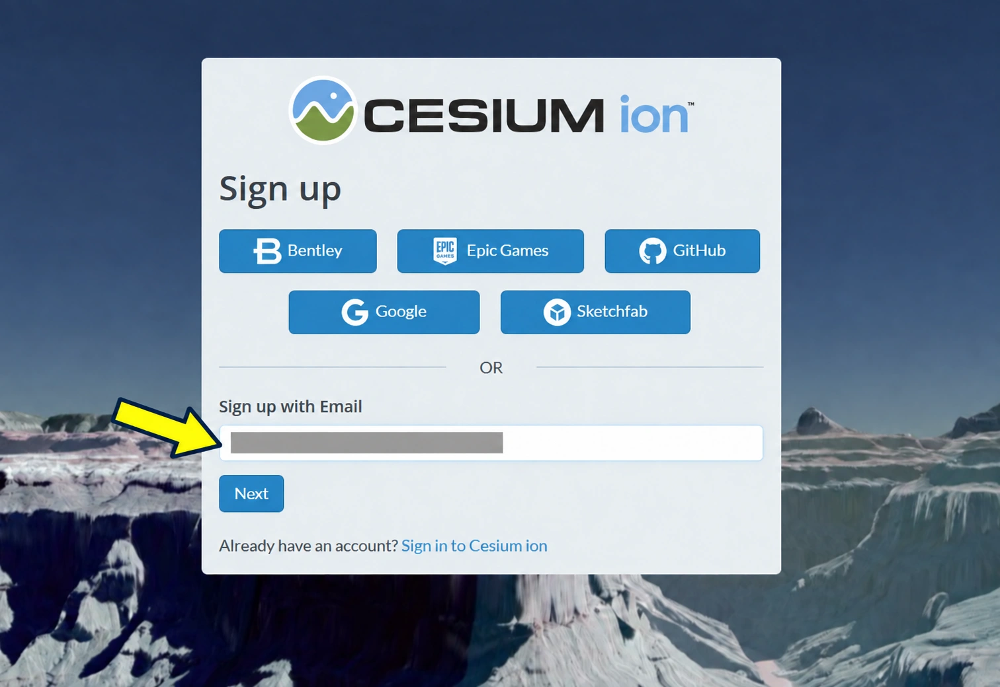
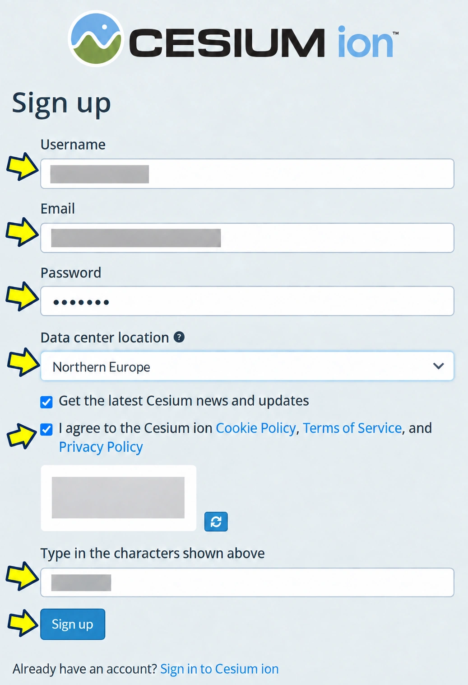
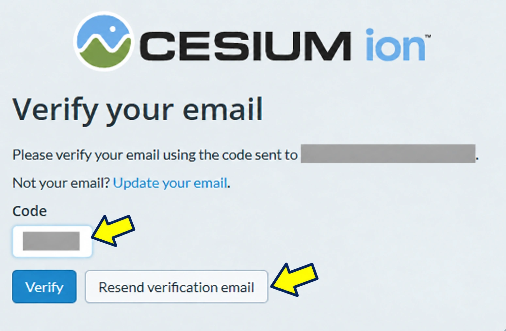
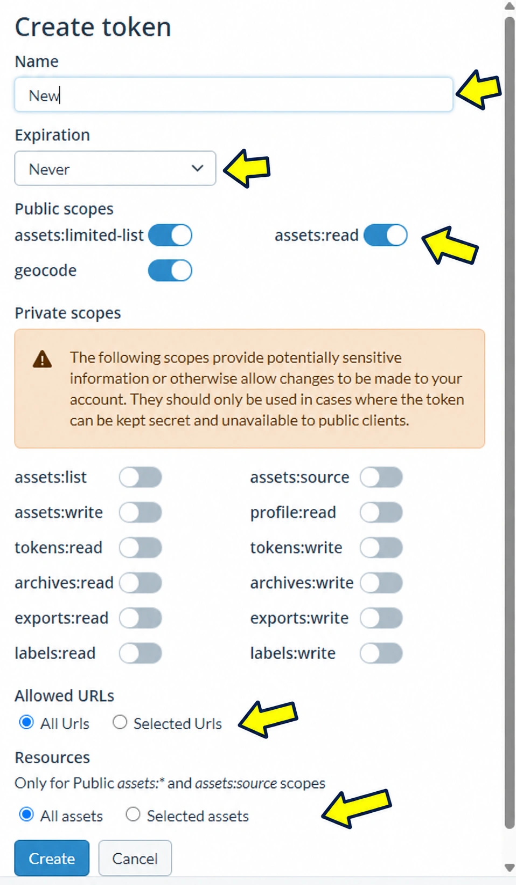
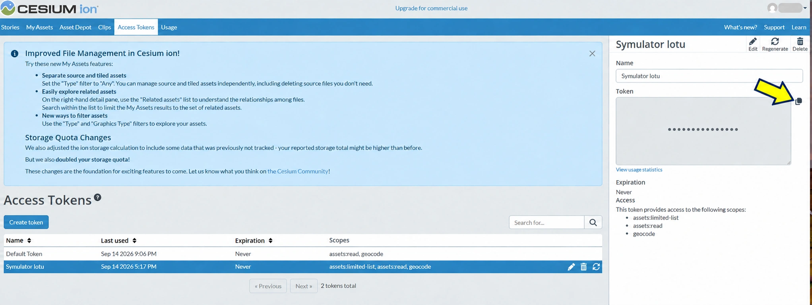
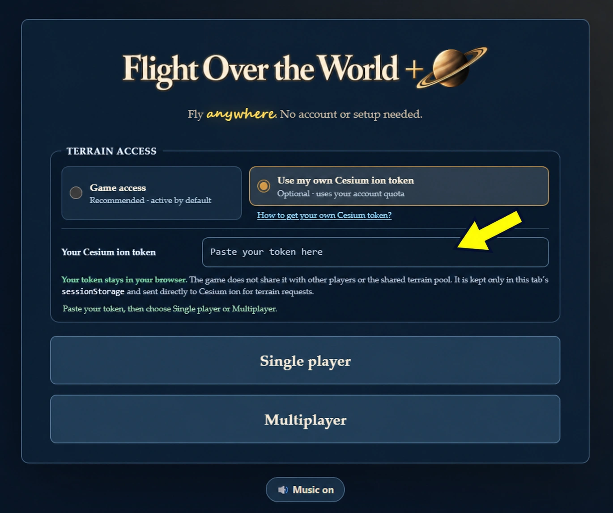

# Jak uzyskać własny token Cesium ion

Gra ma domyślny dostęp do mapy. Własny token jest opcjonalny i pozwala korzystać
z limitu przypisanego do własnego konta Cesium ion.

Poniższe zrzuty pokazują interfejs Cesium ion i gry z września 2026 r. Panel
może później zmienić nazwy lub układ elementów. Dane konta, e-mail, kod,
CAPTCHA i token zostały **trwale zastąpione nieprzezroczystymi maskami**.
Żółte strzałki wskazują pola albo ustawienia, które trzeba uzupełnić lub wybrać.

Wersja dostępna bezpośrednio z opublikowanej gry:
[Jak uzyskać własny token Cesium ion?](https://headlost.github.io/flight-over-the-world-plus/cesium-token-guide.html).

## 1. Rozpocznij rejestrację lub zaloguj się

1. Otwórz [Cesium ion](https://ion.cesium.com/).
2. Użyj jednego z widocznych dostawców logowania albo wpisz własny adres w
   **Sign up with Email** i wybierz **Next**.
3. Jeśli masz już konto, wybierz **Sign in to Cesium ion**.

## 2. Uzupełnij dane konta

1. Wpisz nazwę użytkownika, e-mail i własne silne hasło.
2. Wybierz odpowiednią lokalizację centrum danych.
3. Subskrypcja wiadomości Cesium jest opcjonalna. Zaakceptuj wymagane warunki i
   politykę prywatności.
4. Rozwiąż aktualną CAPTCHA, wpisz jej znaki i wybierz **Sign up**.

Strzałki pokazują pola i wymagane działania. Pole **Get the latest Cesium news
and updates** nie ma strzałki, ponieważ newsletter jest opcjonalny.

## 3. Zweryfikuj adres e-mail

1. Otwórz najnowszą wiadomość weryfikacyjną od Cesium.
2. Wpisz otrzymany kod w pole **Code** i wybierz **Verify**.
3. Jeśli adres na ekranie jest błędny, użyj **Update your email**.

> **Gdy wiadomość nie przychodzi:** sprawdź folder Spam/Junk oraz — zależnie od
> poczty — Oferty lub Inne. Odśwież skrzynkę. Jeśli po kilku minutach nadal nie
> ma wiadomości, kliknij raz **Resend verification email**. Pomaga też
> wylogowanie i ponowne zalogowanie się na konto e-mail. Po ponownym wysłaniu
> użyj kodu z najnowszej wiadomości; nie naciskaj Resend wiele razy pod rząd.

## 4. Dodaj Google Photorealistic 3D Tiles do swoich zasobów

1. Po zalogowaniu otwórz **Asset Depot**.
2. Wyszukaj **Google Photorealistic 3D Tiles**.
3. Sprawdź identyfikator assetu `2275207` i wybierz **Add to my assets**.
4. Upewnij się, że zasób jest widoczny w **My Assets**. Jeżeli już tam jest,
   nie dodawaj go ponownie.

Aktualny opis uruchamiania tego zasobu:
[Photorealistic 3D Tiles w CesiumJS](https://cesium.com/learn/cesiumjs-learn/cesiumjs-photorealistic-3d-tiles/).

## 5. Otwórz Access Tokens

1. W górnym menu panelu ion wybierz **Access Tokens**.
2. Wybierz **Create token**. Utwórz osobny token tylko dla gry zamiast używać
   **Default Token**.
3. Przejdź do formularza konfiguracji pokazanego w następnym kroku.

## 6. Skonfiguruj bezpieczny token

**Uwaga:** zrzut pokazuje formularz w stanie początkowym. Nie kopiuj widocznego
zestawu przełączników jeden do jednego — zastosuj poniższe ograniczenia:

1. W polu **Name** wpisz np. `Flight Over the World +`.
2. Jeśli panel oferuje termin ważności, wybierz okres odpowiadający użyciu. Przy
   **Never** pamiętaj o ręcznym cofnięciu tokenu, gdy przestanie być potrzebny.
3. W sekcji **Public scopes** pozostaw włączone tylko **`assets:read`**.
4. Wyłącz `assets:limited-list` i `geocode`. Gra zna identyfikator assetu i
   korzysta z wyszukiwarki Photon/OSM, więc te zakresy nie są potrzebne.
5. Pozostaw wyłączone wszystkie **Private scopes**, w tym odczyt profilu, list,
   archiwów, eksportów i tokenów oraz wszystkie uprawnienia zapisu.
6. W **Allowed URLs** wybierz **Selected Urls** i dodaj
   `https://headlost.github.io` — bez ścieżki `/flight-over-the-world-plus/`.
7. W **Resources** wybierz **Selected assets** i tylko
   **Google Photorealistic 3D Tiles (`2275207`)**.

Strzałki wskazują obszary do konfiguracji. Docelowo aktywne ma być tylko
`assets:read`, a zaznaczone opcje to **Selected Urls** i **Selected assets**.

Cesium zaleca osobny token dla każdej aplikacji, minimalny zakres uprawnień,
wybrane assety i ograniczenie adresów aplikacji internetowej:
[Cesium ion Access Tokens](https://cesium.com/learn/ion/cesium-ion-access-tokens/).

### Allowed URLs dla innych uruchomień

Dla lokalnego Vite dodaj osobno dokładny origin widoczny w przeglądarce, np.:

- `http://127.0.0.1:5173`;
- `http://localhost:5173`.

Nie zostawiaj **All URLs** ani **All assets**, jeśli nie jest to potrzebne.
Przy publicznej grze nie dodawaj ścieżki projektu do Allowed URLs: przeglądarka
przy żądaniu między domenami przekazuje origin `https://headlost.github.io`.

## 7. Utwórz i skopiuj token

1. Sprawdź ustawienia i wybierz **Create**.
2. Zaznacz nowy token na liście. Po prawej pojawi się panel szczegółów.
3. Użyj ikony kopiowania wskazanej żółtą strzałką.
4. Nie wklejaj tokenu do czatu, wiadomości, zgłoszeń, README, kodu, pliku
   `.env`, commita ani zrzutu ekranu.

Wartość tokenu i profil zostały usunięte z obrazu, a nie tylko lekko rozmyte.
Widoczne zakresy są stanem przykładowym, a nie zalecanym zestawem. Własny token
ustaw zgodnie z krokiem 6 i nigdy nie publikuj jego oryginalnej wartości.

> **Jeśli token był gdziekolwiek widoczny w pełnej formie:** uznaj go za
> ujawniony. W **Access Tokens** usuń go lub użyj funkcji regeneracji, a potem
> utwórz i skopiuj nową wartość. Zamazanie późniejszej kopii obrazu nie
> unieważnia wcześniej ujawnionego tokenu.

## 8. Wklej token w grze

1. Otwórz [Flight Over the World +](https://headlost.github.io/flight-over-the-world-plus/).
2. Na ekranie startowym wybierz **Use my own Cesium ion token**.
3. Wklej token w pole **Paste your token here** wskazane strzałką.
4. Uruchom **Single player** albo **Multiplayer**.

Opcja **Game access** pozostaje zalecana i aktywna domyślnie. Własny token jest
opcjonalny i zużywa limit konta jego właściciela.

## Gdzie gra zapisuje własny token

**Twój token zostaje w bieżącej karcie przeglądarki.** Gra:

- nie udostępnia go innym graczom;
- nie dodaje go do wspólnej puli i nie wysyła do brokera gry;
- przechowuje go wyłącznie w `sessionStorage` tej karty;
- wysyła go bezpośrednio z przeglądarki do Cesium ion, aby pobierać teren;
- nie zapisuje go w `localStorage`;
- usuwa zapis wraz z zakończeniem sesji karty.

Odrzucony własny token nie jest automatycznie zastępowany dostępem operatora.
Żeby do niego wrócić, wybierz jawnie **Game access** na ekranie startowym.

Token aplikacji WWW nie jest hasłem: skrypty działające w tej samej witrynie
mogą odczytać `sessionStorage`, a przeglądarka musi wysłać token do Cesium.
Dlatego ogranicz zakres, asset i Allowed URLs oraz kontroluj zużycie konta.

## Rozwiązywanie problemów

- **Brak wiadomości weryfikacyjnej** — sprawdź Spam/Junk/Oferty, odśwież
  skrzynkę, kliknij raz **Resend verification email** i w razie potrzeby wyloguj
  się oraz zaloguj ponownie do poczty. Użyj najnowszego kodu.
- **401 / invalid token** — token jest błędny, niepełny albo cofnięty; skopiuj go
  ponownie lub utwórz nowy.
- **403 / access denied** — sprawdź `assets:read`, asset `2275207` w
  **My Assets**, wybór **Selected assets** oraz wpisy **Allowed URLs**.
- **402 albo 429 / quota or rate limit** — sprawdź zużycie i plan konta.
  Kolejny token na tym samym koncie nie zwiększa jego limitu.
- **Chcesz wrócić do dostępu gry** — wróć do ekranu startowego i wybierz
  **Game access**.

Oficjalne źródła:

- [Cesium ion](https://ion.cesium.com/)
- [Zarządzanie tokenami Cesium ion](https://cesium.com/learn/ion/cesium-ion-access-tokens/)
- [Google Photorealistic 3D Tiles w CesiumJS](https://cesium.com/learn/cesiumjs-learn/cesiumjs-photorealistic-3d-tiles/)
- [Optymalizacja limitów Cesium ion](https://cesium.com/learn/ion/optimizing-quotas/)
