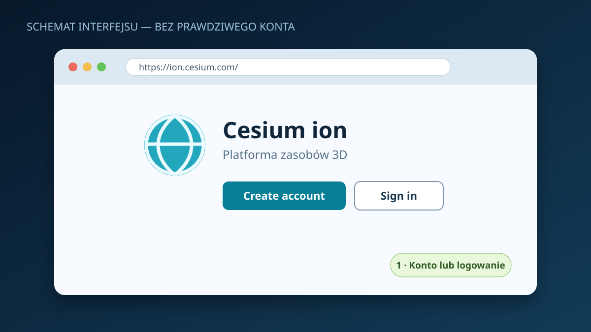
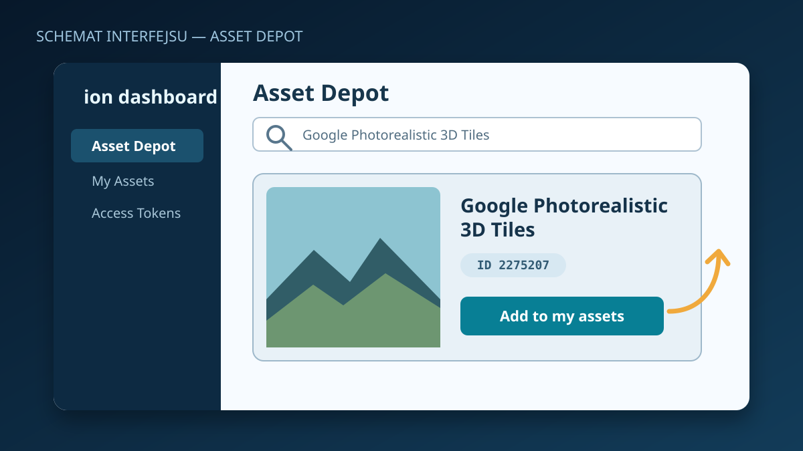
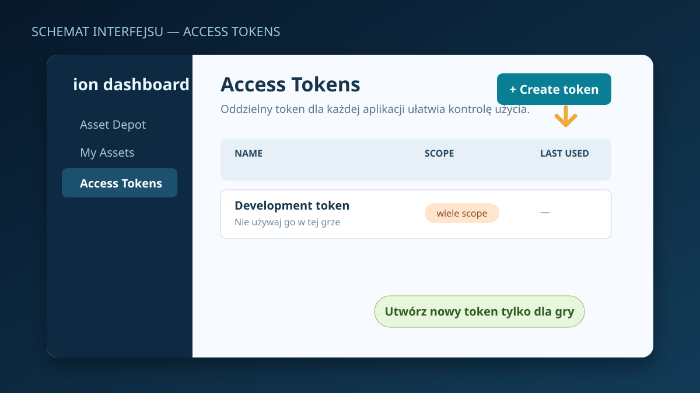
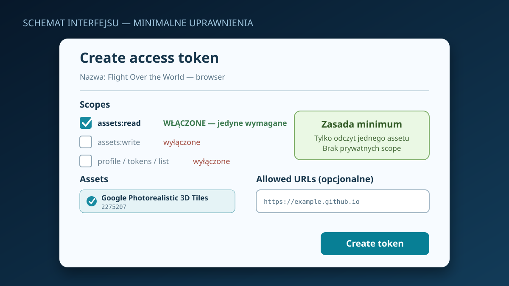
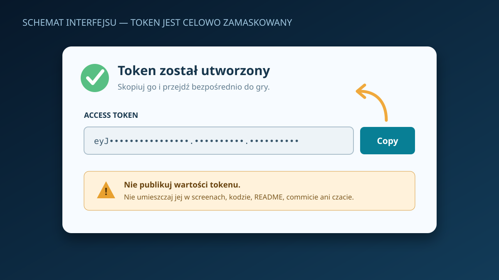
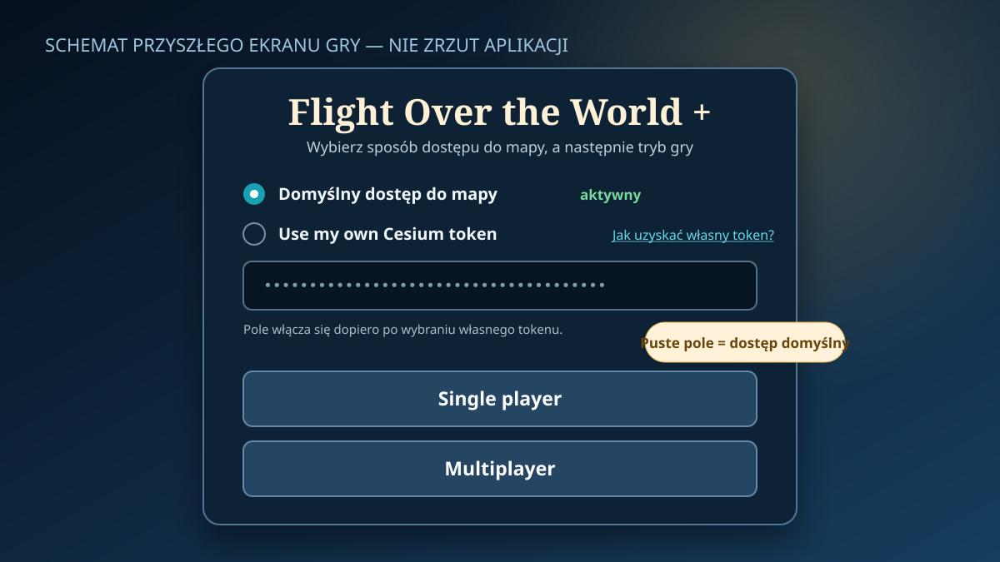

# Jak uzyskać własny token Cesium ion

Gra ma domyślny dostęp do mapy. Własny token jest opcjonalny: pozwala korzystać z
limitu przypisanego do własnego konta Cesium ion. Poniższe obrazy są
**schematami interfejsu**, a nie zrzutami prawdziwego konta. Nazwy i rozmieszczenie
elementów w panelu Cesium mogą z czasem nieznacznie się zmienić.

Wersja tej instrukcji dostępna bezpośrednio z opublikowanej gry:
[`cesium-token-guide.html`](../public/cesium-token-guide.html).

## 1. Załóż konto lub zaloguj się

1. Otwórz [Cesium ion](https://ion.cesium.com/).
2. Wybierz **Create account / Sign up**, jeśli nie masz konta, albo **Sign in**.
3. Dokończ weryfikację wymaganą przez Cesium i przejdź do panelu ion.

## 2. Dodaj Google Photorealistic 3D Tiles do swoich zasobów

1. W panelu ion otwórz **Asset Depot**.
2. Wyszukaj **Google Photorealistic 3D Tiles**.
3. Sprawdź, czy karta wskazuje asset `2275207`.
4. Wybierz **Add to my assets**. Jeżeli zasób jest już na liście **My Assets**,
   nie trzeba dodawać go ponownie.

Aktualna dokumentacja Cesium wymaga, aby Google Photorealistic 3D Tiles były
włączone na koncie: [Photorealistic 3D Tiles w CesiumJS](https://cesium.com/learn/cesiumjs-learn/cesiumjs-photorealistic-3d-tiles/).

## 3. Utwórz osobny token dla gry

1. Otwórz sekcję **Access Tokens** w panelu ion.
2. Wybierz **Create token**.
3. Nadaj mu rozpoznawalną nazwę, np. `Flight Over the World — browser`.

Nie używaj do tego prywatnego tokenu administracyjnego ani tokenu służącego do
przesyłania lub usuwania assetów.

## 4. Ustaw minimalne uprawnienia

W formularzu tokenu:

- włącz tylko publiczne uprawnienie **`assets:read`**;
- nie włączaj `assets:write`, `assets:list`, `profile:read`, `tokens:read` ani
  `tokens:write`;
- uprawnienie `geocode` nie jest potrzebne — wyszukiwanie miejsca w grze nie
  korzysta z geokodera Cesium;
- jeżeli dostępna jest opcja **Selected assets**, ogranicz token do
  **Google Photorealistic 3D Tiles (`2275207`)**.

Cesium zaleca osobny token dla każdej aplikacji, minimalny zakres uprawnień,
wybrane assety i — dla aplikacji internetowej — ograniczenie adresów. Szczegóły:
[Cesium ion Access Tokens](https://cesium.com/learn/ion/cesium-ion-access-tokens/).

### Opcjonalne Allowed URLs

Opcja **Allowed URLs** ogranicza używanie tokenu do wskazanych stron. Dla tej
gry wpisz origin, który przeglądarka faktycznie przekazuje w nagłówku `Referer`:

- `https://headlost.github.io` dla publicznej wersji gry;
- `http://127.0.0.1:5173` dla domyślnego lokalnego serwera deweloperskiego.

Nie dopisuj tu ścieżki `/flight-over-the-world-plus/`: przy domyślnej polityce
przeglądarki żądanie do innej domeny przekazuje sam origin, więc wpis ze ścieżką
mógłby zostać odrzucony. Ograniczenie do `https://headlost.github.io` obejmuje
inne ścieżki i subdomeny tej domeny zgodnie z regułami Cesium, dlatego najważniejszą
dodatkową ochroną pozostaje wybór tylko assetu `2275207` i zakresu `assets:read`.
Jeżeli grasz z kilku originów lub lokalnie, dodaj każdą potrzebną wartość osobno.

## 5. Utwórz i skopiuj token

1. Zatwierdź formularz przyciskiem **Create**.
2. Skopiuj wartość tokenu przyciskiem **Copy**.
3. Nie wklejaj tokenu do zgłoszeń, czatu, README, kodu, commita ani zrzutu
   ekranu. Na screenach pokazuj wyłącznie zamaskowaną wartość.

## 6. Wpisz token w grze

1. Otwórz ekran startowy gry.
2. Domyślnie pozostawiona jest opcja korzystania z dostępu zapewnianego przez
   grę. Aby użyć własnego konta, wybierz **Use my own Cesium token**.
3. Wklej token w zamaskowane pole.
4. Wybierz **Single player** albo **Multiplayer**.

Gra nie udostępnia własnego tokenu innym graczom ani wspólnej puli operatora.
Token jest przechowywany tylko w `sessionStorage` bieżącej karty i wysyłany
bezpośrednio do Cesium ion w żądaniach terenu. Nie jest zapisywany w
`localStorage` ani umieszczany w repozytorium. Po zakończeniu sesji karty
przeglądarka usuwa ten zapis. Skrypty działające w tej samej witrynie nadal mogą
odczytać `sessionStorage`, dlatego należy używać wyłącznie tokenu o minimalnych,
publicznych uprawnieniach.

## Bezpieczeństwo i limity

- Token używany przez aplikację przeglądarkową nie jest sekretem: przeglądarka
  musi wysłać go bezpośrednio do Cesium ion, aby otworzyć asset.
- Użycie własnego tokenu obciąża limity konta, do którego token należy.
- Kontroluj zużycie w panelu ion. Pomoc: [Optimizing quotas](https://cesium.com/learn/ion/optimizing-quotas/).
- Gdy token został ujawniony, natychmiast go unieważnij w **Access Tokens** i
  utwórz nowy.
- Gra nigdy nie potrzebuje uprawnień zapisujących, danych profilu ani zarządzania
  tokenami.

## Rozwiązywanie problemów

- **401 / invalid token** — skopiuj token ponownie albo sprawdź, czy nie został
  cofnięty.
- **403 / access denied** — sprawdź `assets:read`, asset `2275207`, dodanie go do
  **My Assets** oraz wpisy **Allowed URLs** (dla wersji publicznej użyj originu
  `https://headlost.github.io`, bez ścieżki projektu).
- **402 lub 429 / quota or rate limit** — sprawdź zużycie i plan swojego konta;
  tworzenie kolejnych tokenów na tym samym koncie nie zwiększa jego limitu.
- **Brak szczegółowego terenu mimo prawidłowego tokenu** — sprawdź połączenie,
  dostępność danych dla lokalizacji i ponów start po powrocie do ekranu głównego.

Oficjalne źródła:

- [Cesium ion](https://ion.cesium.com/)
- [Zarządzanie tokenami Cesium ion](https://cesium.com/learn/ion/cesium-ion-access-tokens/)
- [Google Photorealistic 3D Tiles w CesiumJS](https://cesium.com/learn/cesiumjs-learn/cesiumjs-photorealistic-3d-tiles/)
- [Optymalizacja limitów Cesium ion](https://cesium.com/learn/ion/optimizing-quotas/)
